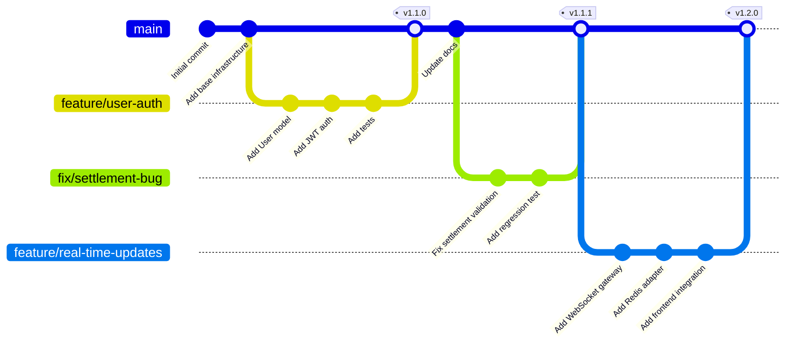

# Contributing to Campaign Manager

Thank you for your interest in contributing to the Campaign Manager project! This document provides guidelines and instructions for contributing to this project.

## Table of Contents

1. [Code of Conduct](#code-of-conduct)
2. [Getting Started](#getting-started)
3. [Development Setup](#development-setup)
4. [Project Structure](#project-structure)
5. [Code Standards](#code-standards)
6. [Testing Requirements](#testing-requirements)
7. [Git Workflow](#git-workflow)
8. [Pull Request Process](#pull-request-process)
9. [Documentation](#documentation)
10. [Getting Help](#getting-help)

---

## Code of Conduct

We are committed to providing a welcoming and inclusive environment for all contributors. Please:

- Be respectful and considerate in all interactions
- Provide constructive feedback
- Focus on what is best for the community and project
- Show empathy towards other community members

---

## Getting Started

### Prerequisites

- **Node.js**: >= 18.0.0
- **pnpm**: >= 8.0.0 (required - we do not support npm or yarn)
- **Docker**: For running PostgreSQL + PostGIS and Redis locally
- **Git**: For version control

### First-Time Setup

1. **Fork and clone the repository**:

   ```bash
   git clone https://github.com/YOUR_USERNAME/campaign_manager.git
   cd campaign_manager
   ```

2. **Install dependencies**:

   ```bash
   pnpm install
   ```

3. **Set up environment variables**:

   ```bash
   # Copy example environment files
   cp .env.example .env
   cp packages/api/.env.example packages/api/.env
   cp packages/frontend/.env.example packages/frontend/.env

   # Edit .env files with your local configuration
   ```

4. **Start development services**:

   ```bash
   # Start PostgreSQL + PostGIS and Redis
   docker compose up -d postgres redis

   # Run database migrations
   pnpm --filter @campaign/api exec prisma migrate deploy

   # (Optional) Seed the database with demo data
   pnpm --filter @campaign/api exec ts-node src/database/seed/seed.ts
   ```

5. **Verify setup**:

   ```bash
   # Type-check all packages
   pnpm run type-check

   # Lint all packages
   pnpm run lint

   # Run all tests
   pnpm run test

   # Build all packages
   pnpm run build
   ```

For detailed setup instructions, see [README.md](README.md).

---

## Development Setup

### Running the Development Server

**IMPORTANT**: Always run commands from the project root. Never use `cd` to navigate into package directories.

```bash
# Run all services in parallel (API, Frontend, Rules Engine, Scheduler)
pnpm run dev

# Run specific package
pnpm --filter @campaign/api dev
pnpm --filter @campaign/frontend dev
pnpm --filter @campaign/rules-engine dev
pnpm --filter @campaign/scheduler dev
```

### Common Development Commands

All commands should be run from the project root:

```bash
# Install dependencies
pnpm install

# Type-check all packages
pnpm run type-check

# Type-check specific package
pnpm --filter @campaign/api type-check

# Lint all packages
pnpm run lint

# Lint specific package
pnpm --filter @campaign/api lint

# Auto-fix linting issues
pnpm run lint -- --fix

# Format all code
pnpm run format

# Check formatting without fixing
pnpm run format:check

# Run all tests
pnpm run test

# Run tests for specific package
pnpm --filter @campaign/api test

# Run tests in watch mode (for TDD)
pnpm --filter @campaign/api test:watch

# Build all packages
pnpm run build

# Build specific package
pnpm --filter @campaign/api build

# Clean build artifacts
pnpm run clean
```

### Adding Dependencies

```bash
# Add to root (dev dependencies only)
pnpm add -D -w <package>

# Add to specific package
pnpm --filter @campaign/api add <package>

# Add dev dependency to specific package
pnpm --filter @campaign/api add -D <package>
```

---

## Project Structure

This is a **pnpm monorepo** with the following structure:

```
campaign_manager/
├── packages/
│   ├── api/               # NestJS GraphQL API
│   ├── rules-engine/      # Rules evaluation worker (gRPC + HTTP)
│   ├── scheduler/         # Event scheduling worker
│   ├── frontend/          # React + Vite application
│   └── shared/            # Shared types and utilities
├── plan/                  # Project planning and tickets
├── docs/                  # Documentation
│   ├── features/          # Feature documentation
│   ├── architecture/      # System architecture docs
│   ├── deployment/        # Deployment guides
│   └── development/       # Development guides
├── .github/workflows/     # CI/CD workflows
├── .husky/                # Git hooks
├── CLAUDE.md              # AI agent development guide
├── CONTRIBUTING.md        # This file
└── README.md              # User-facing documentation
```

### Package Overview

| Package                  | Purpose                                   | Tech Stack                          |
| ------------------------ | ----------------------------------------- | ----------------------------------- |
| `@campaign/api`          | GraphQL API, WebSocket, database          | NestJS, Prisma, Apollo Server       |
| `@campaign/rules-engine` | JSONLogic condition evaluation            | Node.js, gRPC, HTTP API             |
| `@campaign/scheduler`    | Time-based operations, periodic tasks     | Node.js, Bull (Redis queues), Axios |
| `@campaign/frontend`     | Web UI                                    | React, Vite, Apollo Client, Zustand |
| `@campaign/shared`       | Shared types, utilities, validation logic | TypeScript                          |

### Build Order

Packages have dependencies and must be built in order:

1. `@campaign/shared` (no dependencies)
2. `@campaign/api`, `@campaign/rules-engine`, `@campaign/scheduler` (depend on shared)
3. `@campaign/frontend` (uses types from shared)

The `pnpm run build` command handles this automatically.

---

## Code Standards

### TypeScript Configuration

- **Strict mode**: Enabled (non-negotiable)
- **Target**: ES2022
- **Module**: CommonJS (backend), ESNext (frontend)
- All code must type-check without errors

### ESLint Rules

Key rules from `.eslintrc.json`:

- **Import ordering**: builtin → external → internal → parent → sibling → index (alphabetized)
- **Unused parameters**: Allowed if prefixed with `_` (e.g., `_unused: string`)
- **`any` type**: Warn level only (prefer `unknown` or explicit types)
- **Return types**: Not required, but recommended for complex functions

### Prettier Configuration

- **Print width**: 100 characters (strict)
- **Quotes**: Single quotes
- **Indentation**: 2 spaces
- **Trailing commas**: ES5 style
- **Line endings**: LF (Unix-style)

### Naming Conventions

**Files**:

- Services: `*.service.ts`
- Resolvers: `*.resolver.ts`
- DTOs: `*.dto.ts`
- Utilities: `*.util.ts` or `*.utils.ts`
- Tests: `*.test.ts`, `*.spec.ts`, `*.integration.test.ts`

**Code**:

- Classes: `PascalCase` (e.g., `CampaignService`, `UserResolver`)
- Methods/functions: `camelCase` (e.g., `findById`, `validatePassword`)
- Constants: `SCREAMING_SNAKE_CASE` (e.g., `MAX_FILE_SIZE`, `REDIS_PUBSUB`)
- Interfaces/Types: `PascalCase` (e.g., `Campaign`, `AuthenticatedUser`)

**Path Aliases** (use instead of relative imports):

```typescript
// Good
import { BaseEntity } from '@campaign/shared';
import { CampaignService } from '@campaign/api/campaigns';

// Bad
import { BaseEntity } from '../../../shared/src/types';
import { CampaignService } from '../campaigns/campaign.service';
```

Available aliases:

- `@campaign/shared` → `packages/shared/src`
- `@campaign/api` → `packages/api/src`
- `@campaign/rules-engine` → `packages/rules-engine/src`
- `@campaign/scheduler` → `packages/scheduler/src`

### Code Formatting

**Documentation style**:

```typescript
/**
 * Campaign Service
 * Business logic for Campaign operations
 * Implements CRUD with soft delete, archive, and cascade delete
 */
@Injectable()
export class CampaignService {
  /**
   * Find campaign by ID
   * Ensures user has access to the campaign
   */
  async findById(id: string, user: AuthenticatedUser): Promise<Campaign | null> {
    // Implementation
  }
}
```

**Error handling**:

```typescript
// Use NestJS exceptions
throw new ForbiddenException('User does not have access to this campaign');
throw new BadRequestException('Invalid campaign ID format');

// Include descriptive error messages
throw new NotFoundException(`Campaign with ID ${id} not found`);
```

**Async code**:

```typescript
// Good - use async/await
async function fetchData() {
  const result = await database.query();
  return result;
}

// Bad - avoid .then() chains
function fetchData() {
  return database.query().then((result) => result);
}
```

**Type safety**:

```typescript
// Good - explicit types
import type { Campaign } from '@campaign/shared';
const campaigns: Campaign[] = await fetchCampaigns();

// Bad - implicit any
const campaigns = await fetchCampaigns(); // Type is any

// Good - use unknown instead of any
function parseJson(input: string): unknown {
  return JSON.parse(input);
}
```

---

## Testing Requirements

### Testing Frameworks

- **Backend**: Jest with `ts-jest` preset
- **Frontend**: Vitest with `happy-dom` environment
- **Integration tests**: Real PostgreSQL + PostGIS + Redis containers

### Test File Organization

Tests should be colocated with source files or in a `__tests__` directory:

```
packages/api/src/
├── campaigns/
│   ├── campaign.service.ts
│   ├── campaign.service.test.ts        # Unit test
│   └── campaign.integration.test.ts    # Integration test
└── __tests__/
    └── integration/
        └── graphql/
```

### Test Naming Conventions

**Files**:

- Unit tests: `*.test.ts` or `*.spec.ts`
- Integration tests: `*.integration.test.ts`
- E2E tests: `*.e2e.test.ts`

**Test structure**:

```typescript
describe('CampaignService', () => {
  describe('findById', () => {
    it('should return campaign when it exists', async () => {
      // Arrange
      const mockCampaign = { id: '1', name: 'Test Campaign' };

      // Act
      const result = await service.findById('1', user);

      // Assert
      expect(result).toEqual(mockCampaign);
    });

    it('should return null when campaign does not exist', async () => {
      // Arrange, Act, Assert
      const result = await service.findById('nonexistent', user);
      expect(result).toBeNull();
    });

    it('should throw ForbiddenException when user lacks access', async () => {
      // Arrange, Act, Assert
      await expect(service.findById('1', unauthorizedUser)).rejects.toThrow(ForbiddenException);
    });
  });
});
```

### Writing Tests

**Backend unit test example**:

```typescript
import { Test, TestingModule } from '@nestjs/testing';
import { CampaignService } from './campaign.service';
import { PrismaService } from '../database/prisma.service';

describe('CampaignService', () => {
  let service: CampaignService;
  let prisma: PrismaService;

  beforeEach(async () => {
    const module: TestingModule = await Test.createTestingModule({
      providers: [
        CampaignService,
        {
          provide: PrismaService,
          useValue: {
            campaign: {
              findUnique: jest.fn(),
              create: jest.fn(),
            },
          },
        },
      ],
    }).compile();

    service = module.get<CampaignService>(CampaignService);
    prisma = module.get<PrismaService>(PrismaService);
  });

  it('should be defined', () => {
    expect(service).toBeDefined();
  });

  // Add more tests...
});
```

**Frontend test example**:

```typescript
import { describe, it, expect, vi } from 'vitest';
import { render, screen } from '@testing-library/react';
import { CampaignList } from './CampaignList';

describe('CampaignList', () => {
  it('should render campaigns', () => {
    const campaigns = [
      { id: '1', name: 'Campaign 1' },
      { id: '2', name: 'Campaign 2' },
    ];

    render(<CampaignList campaigns={campaigns} />);

    expect(screen.getByText('Campaign 1')).toBeInTheDocument();
    expect(screen.getByText('Campaign 2')).toBeInTheDocument();
  });
});
```

### Test Requirements

**All contributions must include tests:**

- New features: Add unit tests + integration tests where applicable
- Bug fixes: Add test that reproduces the bug, then fix it (TDD approach)
- Refactoring: Ensure existing tests still pass

**Test coverage:**

- We collect coverage data but don't enforce strict thresholds
- Aim for reasonable coverage of critical paths
- Focus on testing behavior, not implementation details

**Running tests:**

```bash
# Run all tests
pnpm run test

# Run tests for specific package
pnpm --filter @campaign/api test

# Run tests in watch mode (for TDD)
pnpm --filter @campaign/api test:watch

# Run tests with coverage
pnpm --filter @campaign/api test -- --coverage

# Run specific test file
pnpm --filter @campaign/api test -- campaign.service.test.ts
```

### Test-Driven Development (TDD)

We encourage TDD for new features:

1. **Red**: Write a failing test
2. **Green**: Write minimal code to make it pass
3. **Refactor**: Clean up while keeping tests green

Example workflow:

```bash
# Start watch mode
pnpm --filter @campaign/api test:watch

# Write failing test, save file (test runs automatically)
# Write implementation, save file (test runs automatically)
# Refactor, save file (tests run automatically)
```

---

## Git Workflow

### Branch Strategy

- **Main branch**: `main` - Production-ready code
- **Feature branches**: Create from `main`, named descriptively
  - Examples: `feature/add-user-auth`, `fix/campaign-validation`, `docs/api-guide`

**Visual Workflow**:



**Workflow Steps**:

1. **Fork and clone** the repository
2. **Create feature branch** from `main`
3. **Make changes** with atomic commits
4. **Run quality checks** (type-check, lint, test, build)
5. **Push branch** to your fork
6. **Open Pull Request** against `main`
7. **Address feedback** from code review
8. **Merge** when approved and CI passes

### Commit Message Format

We use [Conventional Commits](https://www.conventionalcommits.org/) format:

```
<type>(<scope>): <short summary (≤72 chars)>

<detailed body explaining WHY, implementation decisions, context>

🤖 Generated with [Claude Code](https://claude.com/claude-code)

Co-Authored-By: Claude <noreply@anthropic.com>
```

**Note**: The footer attribution is optional for human contributors. It's primarily used by AI agents.

**Types**:

- `feat`: New feature
- `fix`: Bug fix
- `docs`: Documentation changes
- `refactor`: Code changes that neither fix bugs nor add features
- `test`: Adding or updating tests
- `chore`: Changes to build process, dependencies, or tooling
- `perf`: Performance improvements
- `style`: Code style changes (formatting, missing semi-colons)

**Scopes** (package names):

- `api`, `frontend`, `shared`, `rules-engine`, `scheduler`
- `root` - Root-level config or multiple packages
- `plan`, `database`, `packages`, etc.

**Examples**:

```bash
# Feature commit
git commit -m "$(cat <<'EOF'
feat(api): add user authentication endpoints

Implements JWT-based authentication flow with refresh tokens.
Added login, refresh, and logout endpoints using bcrypt for
password hashing. Tokens expire after 15 minutes (access) and
7 days (refresh).

Part of TICKET-004 implementation.
EOF
)"

# Bug fix commit
git commit -m "$(cat <<'EOF'
fix(frontend): correct campaign list sorting

Fixed bug where campaigns were not sorting by creation date.
Added proper date comparison logic and ensured timezone handling
is consistent across all clients.

Resolves issue where newly created campaigns appeared at the
bottom instead of the top.
EOF
)"

# Documentation commit
git commit -m "docs(api): update GraphQL schema documentation

Added detailed JSDoc comments to all GraphQL resolvers explaining
parameters, return types, and error conditions. Improves developer
experience when using the API."
```

### Pre-Commit Hooks

We use Husky to enforce quality checks before commits:

1. **Format check**: Verifies code is formatted with Prettier
2. **Lint check**: Runs ESLint on all files
3. **Lint-staged**: Auto-fixes staged TypeScript and JSON files

If the pre-commit hook fails:

```bash
# Fix formatting issues
pnpm run format

# Fix linting issues
pnpm run lint -- --fix

# Re-stage fixed files
git add .

# Try commit again
git commit
```

---

## Pull Request Process

### Before Opening a PR

1. **Ensure all quality checks pass**:

   ```bash
   pnpm run type-check
   pnpm run lint
   pnpm run test
   pnpm run build
   ```

2. **Update documentation** if needed:
   - Update README.md for user-facing changes
   - Update CLAUDE.md for development pattern changes
   - Add/update feature docs in `docs/features/`
   - Update API documentation if GraphQL schema changed

3. **Write tests** for your changes:
   - Unit tests for new functionality
   - Integration tests for API/database changes
   - Update existing tests if behavior changed

4. **Commit with detailed messages** explaining WHY, not just WHAT

### Opening a PR

1. **Push your branch** to your fork:

   ```bash
   git push origin feature/your-feature-name
   ```

2. **Open a pull request** on GitHub with:
   - Clear, descriptive title
   - Detailed description of changes
   - Reference any related issues/tickets
   - Screenshots for UI changes
   - Breaking changes clearly noted

3. **PR template** (use this format):

   ```markdown
   ## Description

   [Clear description of what this PR does and why]

   ## Type of Change

   - [ ] Bug fix (non-breaking change which fixes an issue)
   - [ ] New feature (non-breaking change which adds functionality)
   - [ ] Breaking change (fix or feature that would cause existing functionality to not work as expected)
   - [ ] Documentation update

   ## Related Issues/Tickets

   - Fixes #[issue number]
   - Part of TICKET-035

   ## How Has This Been Tested?

   - [ ] Unit tests
   - [ ] Integration tests
   - [ ] Manual testing

   ## Checklist

   - [ ] My code follows the project's code standards
   - [ ] I have performed a self-review of my code
   - [ ] I have commented my code where necessary
   - [ ] I have updated the documentation
   - [ ] My changes generate no new warnings
   - [ ] I have added tests that prove my fix is effective or that my feature works
   - [ ] New and existing unit tests pass locally
   - [ ] Any dependent changes have been merged and published

   ## Screenshots (if applicable)

   [Add screenshots for UI changes]

   ## Breaking Changes

   [Describe any breaking changes and migration path]
   ```

### PR Review Process

1. **Automated checks** must pass:
   - Type-check
   - Linting
   - All tests (backend + frontend)
   - Build verification
   - Performance benchmarks (for rules-engine changes)

2. **Code review** by maintainers:
   - Code quality and standards adherence
   - Test coverage and quality
   - Documentation completeness
   - Security considerations
   - Performance impact

3. **Address feedback**:
   - Make requested changes in new commits
   - Respond to review comments
   - Request re-review when ready

4. **Merge**:
   - Maintainers will merge when approved
   - Squash-merge or regular merge depending on commit history

### After PR Merge

- Delete your feature branch (both locally and remotely)
- Pull latest changes from main:
  ```bash
  git checkout main
  git pull upstream main
  ```

---

## Documentation

### Documentation Requirements

When contributing, update documentation as needed:

1. **README.md**: User-facing setup and usage instructions
2. **CLAUDE.md**: Development patterns and AI agent guidelines
3. **Feature docs** (`docs/features/`): Detailed feature documentation
4. **Architecture docs** (`docs/architecture/`): System design and data models
5. **Deployment docs** (`docs/deployment/`): Production deployment guides
6. **Package READMEs**: Quick-start guides for each package
7. **Code comments**: JSDoc for public APIs, inline comments for complex logic

### Documentation Style

- Use clear, concise language
- Include code examples
- Add diagrams where helpful (ASCII art or Mermaid)
- Cross-reference related documentation
- Keep user docs and developer docs separate

### Documentation Locations

| Type                  | Location                      | Audience     |
| --------------------- | ----------------------------- | ------------ |
| Getting started       | `README.md`                   | Users        |
| User tutorials        | `docs/user-guide/`            | Users        |
| Feature documentation | `docs/features/`              | Users + Dev  |
| Architecture          | `docs/architecture/`          | Developers   |
| Deployment guides     | `docs/deployment/`            | DevOps       |
| Development patterns  | `CLAUDE.md`                   | AI agents    |
| Contributing guide    | `CONTRIBUTING.md` (this file) | Contributors |
| API documentation     | GraphQL schema + `docs/api/`  | Developers   |
| Package quick-starts  | `packages/*/README.md`        | Developers   |

---

## Getting Help

### Resources

- **README.md**: User-facing setup and features
- **CLAUDE.md**: Development guidelines and patterns
- **Feature docs**: `docs/features/` for detailed feature documentation
- **Architecture docs**: `docs/architecture/` for system design
- **Deployment docs**: `docs/deployment/` for production setup

### Questions and Discussions

- **GitHub Issues**: Report bugs or request features
- **GitHub Discussions**: Ask questions, share ideas
- **Pull Requests**: Propose changes with clear descriptions

### Common Issues

**Build failures**:

```bash
# Clean and rebuild
pnpm run clean
pnpm install
pnpm run build
```

**Test failures**:

```bash
# Ensure database is running
docker compose up -d postgres redis

# Run migrations
pnpm --filter @campaign/api exec prisma migrate deploy

# Run tests
pnpm run test
```

**Type errors**:

```bash
# Check all packages
pnpm run type-check

# Check specific package
pnpm --filter @campaign/api type-check
```

**Linting errors**:

```bash
# Auto-fix where possible
pnpm run lint -- --fix

# Check specific package
pnpm --filter @campaign/api lint -- --fix
```

---

## Additional Notes

### Monorepo Best Practices

- **Never use `cd`**: Always run commands from project root with `pnpm --filter`
- **Build order matters**: `shared` must build before other packages
- **Workspace dependencies**: Use `workspace:*` in package.json for internal deps
- **Frozen lockfile**: CI uses `--frozen-lockfile` - commit lockfile changes

### Performance Considerations

- **Database queries**: Use DataLoader to prevent N+1 queries
- **GraphQL**: Implement field-level caching where appropriate
- **Frontend**: Lazy load components and routes
- **Rules engine**: Cache expensive condition evaluations

### Security Considerations

- **Never commit secrets**: Use environment variables
- **Validate input**: All user input must be validated
- **SQL injection**: Use Prisma parameterized queries (never raw SQL with interpolation)
- **XSS**: Sanitize user-generated content
- **CORS**: Configure allowed origins properly
- **Authentication**: Use JWT with appropriate expiration

---

Thank you for contributing to Campaign Manager! Your efforts help make this project better for everyone.
