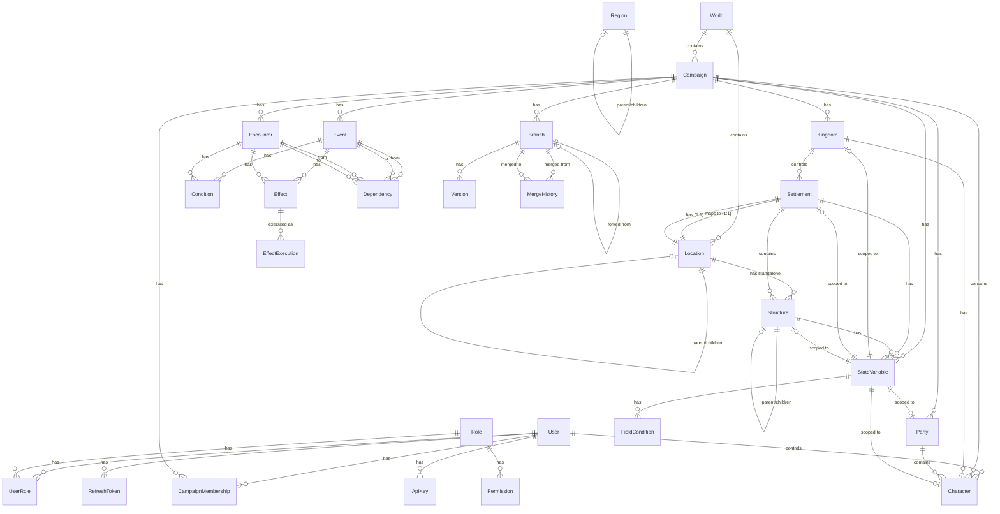
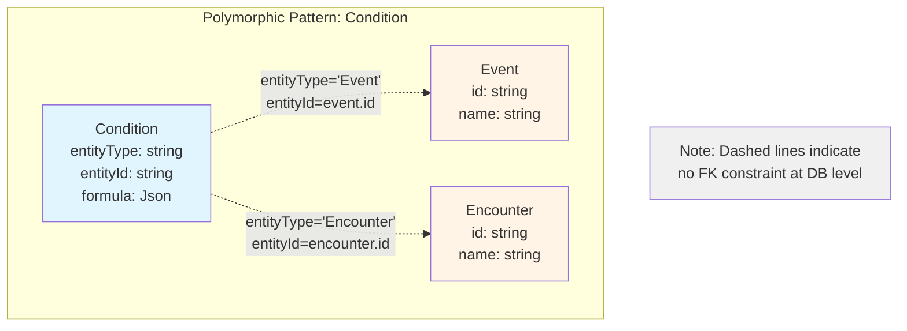

# Data Model Documentation

This document provides comprehensive documentation of the Campaign Manager's data model, including the Prisma schema structure, relationships between entities, and key design patterns.

## Table of Contents

- [Overview](#overview)
- [Database Configuration](#database-configuration)
- [Core Entity Categories](#core-entity-categories)
- [Key Entities](#key-entities)
  - [Authentication & Authorization](#authentication--authorization)
  - [Campaign Structure](#campaign-structure)
  - [Geography & Locations](#geography--locations)
  - [Actors](#actors)
  - [Events & Encounters](#events--encounters)
  - [State Management](#state-management)
  - [Versioning & Branching](#versioning--branching)
  - [Audit & History](#audit--history)
- [Relationships](#relationships)
- [Design Patterns](#design-patterns)
- [Special Features](#special-features)
- [Query Patterns](#query-patterns)
- [Schema Evolution](#schema-evolution)

---

## Overview

The Campaign Manager uses **Prisma ORM** with **PostgreSQL** and the **PostGIS** extension for spatial data. The schema is designed to support complex tabletop RPG campaigns with:

- **Hierarchical geography** (regions, locations, settlements, structures)
- **Temporal tracking** (both game world time and system time)
- **Alternate timeline branches** (for "what-if" scenarios)
- **Dynamic state management** (with typed variables and conditions)
- **Event-driven workflows** (with effects, dependencies, and resolution)
- **Comprehensive audit logging** (with state snapshots and diffs)

**Schema Location**: `packages/api/prisma/schema.prisma`

---

## Database Configuration

```prisma
datasource db {
  provider   = "postgresql"
  url        = env("DATABASE_URL")
  extensions = [postgis(version: "3.3.2")]
}

generator client {
  provider        = "prisma-client-js"
  previewFeatures = ["postgresqlExtensions"]
}
```

**Key Points**:

- **PostgreSQL** with PostGIS for spatial operations
- **CUID** primary keys for all models (collision-resistant, sortable)
- **Extensions**: PostGIS 3.3.2 for geography/geometry types

---

## Core Entity Categories

The data model is organized into logical categories:

| Category                   | Models                                                                     |
| -------------------------- | -------------------------------------------------------------------------- |
| **Auth & Authorization**   | User, Role, Permission, UserRole, CampaignMembership, RefreshToken, ApiKey |
| **Campaign Structure**     | World, Campaign, Branch                                                    |
| **Geography & Locations**  | Location, Region, Settlement, Structure                                    |
| **Actors**                 | Kingdom, Party, Character                                                  |
| **Events & Encounters**    | Encounter, Event, Condition, Effect, EffectExecution                       |
| **State Management**       | StateVariable, FieldCondition                                              |
| **Dependencies & Links**   | Dependency, Link                                                           |
| **Versioning & Branching** | Version, MergeHistory                                                      |
| **Audit & History**        | Audit                                                                      |

---

## Key Entities

### Authentication & Authorization

#### User

The central user account model supporting multiple campaigns.

```prisma
model User {
  id            String   @id @default(cuid())
  email         String   @unique
  passwordHash  String
  name          String?
  avatarUrl     String?
  isActive      Boolean  @default(true)
  emailVerified Boolean  @default(false)
  createdAt     DateTime @default(now())
  updatedAt     DateTime @updatedAt

  // Relationships
  roles              UserRole[]
  campaignMemberships CampaignMembership[]
  refreshTokens      RefreshToken[]
  apiKeys            ApiKey[]
  characters         Character[]
  audits             Audit[]

  @@index([email])
}
```

**Key Features**:

- **Email-based authentication** with bcrypt password hashing
- **Many-to-many roles** via UserRole junction table
- **Campaign memberships** with role-specific permissions
- **API key support** for programmatic access
- **Soft activation** via isActive flag

#### Role & Permission

Flexible role-based access control (RBAC) system.

```prisma
model Role {
  id          String   @id @default(cuid())
  name        String   @unique
  description String?
  createdAt   DateTime @default(now())
  updatedAt   DateTime @updatedAt

  userRoles   UserRole[]
  permissions Permission[]
}

model Permission {
  id          String   @id @default(cuid())
  action      String   // e.g., "create:event", "read:campaign", "delete:character"
  resource    String   // e.g., "event", "campaign", "character"
  description String?

  roles Role[]

  @@unique([action, resource])
}
```

**Key Features**:

- **Fine-grained permissions** with action:resource pattern
- **Roles aggregate permissions** for easier assignment
- **Many-to-many**: Users can have multiple roles, roles can have multiple permissions

#### CampaignMembership

Links users to campaigns with specific roles.

```prisma
enum CampaignRole {
  OWNER
  GM
  PLAYER
  VIEWER
}

model CampaignMembership {
  id         String       @id @default(cuid())
  userId     String
  campaignId String
  role       CampaignRole
  createdAt  DateTime     @default(now())
  updatedAt  DateTime     @updatedAt

  user     User     @relation(fields: [userId], references: [id], onDelete: Cascade)
  campaign Campaign @relation(fields: [campaignId], references: [id], onDelete: Cascade)

  @@unique([userId, campaignId])
  @@index([campaignId])
}
```

**Campaign Roles**:

- **OWNER**: Full admin access, can delete campaign
- **GM**: Game master, can modify most entities
- **PLAYER**: Can view and interact with assigned characters
- **VIEWER**: Read-only access

---

### Campaign Structure

#### World

The top-level container for game worlds.

```prisma
model World {
  id        String   @id @default(cuid())
  name      String
  createdAt DateTime @default(now())
  updatedAt DateTime @updatedAt

  campaigns Campaign[]
  locations Location[]
}
```

**Purpose**: Allows multiple campaigns to share the same world (e.g., same map, different timelines).

#### Campaign

The primary organizational unit for a game campaign.

```prisma
model Campaign {
  id          String    @id @default(cuid())
  name        String
  description String?
  worldId     String
  isActive    Boolean   @default(true)
  startDate   DateTime?
  endDate     DateTime?
  createdAt   DateTime  @default(now())
  updatedAt   DateTime  @updatedAt

  world               World                 @relation(fields: [worldId], references: [id], onDelete: Cascade)
  branches            Branch[]
  memberships         CampaignMembership[]
  parties             Party[]
  kingdoms            Kingdom[]
  characters          Character[]
  events              Event[]
  encounters          Encounter[]
  stateVariables      StateVariable[]
  audits              Audit[]

  @@index([worldId])
  @@index([isActive])
}
```

**Key Features**:

- **One campaign = one active game**
- **Multiple branches** for alternate timelines
- **Date range** for campaign duration
- **Soft activation** for archiving without deletion

#### Branch

Represents an alternate timeline within a campaign.

```prisma
model Branch {
  id              String    @id @default(cuid())
  campaignId      String
  name            String
  description     String?
  parentBranchId  String?   // Self-referential for branch hierarchy
  divergedAt      DateTime? // World time when branch diverged
  isActive        Boolean   @default(true)
  customVariables Json      @default("{}") // Branch-specific state variables
  createdAt       DateTime  @default(now())
  updatedAt       DateTime  @updatedAt

  campaign       Campaign       @relation(fields: [campaignId], references: [id], onDelete: Cascade)
  parentBranch   Branch?        @relation("BranchHierarchy", fields: [parentBranchId], references: [id])
  childBranches  Branch[]       @relation("BranchHierarchy")
  versions       Version[]
  mergeHistories MergeHistory[]

  @@index([campaignId])
  @@index([parentBranchId])
  @@index([isActive])
}
```

**Key Features**:

- **Hierarchical branching**: Branches can fork from other branches
- **Divergence tracking**: Records when timeline split occurred
- **Custom variables**: Track alternate timeline state (JSON object)
- **Version control**: Each branch maintains its own version history

---

### Geography & Locations

#### Location

The primary geography model with spatial data support.

```prisma
model Location {
  id               String                     @id @default(cuid())
  worldId          String
  name             String
  description      String?
  locationType     String                     // e.g., "Region", "City", "Forest", "Dungeon"
  parentLocationId String?                    // Self-referential for hierarchies
  geom             Unsupported("geography")?  // PostGIS geography (point, polygon, etc.)
  properties       Json                       @default("{}") // Flexible metadata
  createdAt        DateTime                   @default(now())
  updatedAt        DateTime                   @updatedAt

  world            World       @relation(fields: [worldId], references: [id], onDelete: Cascade)
  parentLocation   Location?   @relation("LocationHierarchy", fields: [parentLocationId], references: [id])
  childLocations   Location[]  @relation("LocationHierarchy")
  settlements      Settlement[]
  structures       Structure[]
  encounters       Encounter[]

  @@index([worldId])
  @@index([parentLocationId])
  @@index([locationType])
  @@index([geom], type: Gist) // Spatial index
}
```

**Key Features**:

- **PostGIS geography**: Stores points, polygons, lines with spatial operations
- **Hierarchical**: Locations can contain other locations (e.g., Region → City → District)
- **Flexible typing**: locationType allows custom categorization
- **Spatial indexing**: GIST index for fast spatial queries

**Example PostGIS Queries**:

```typescript
// Find locations within 50km of a point
const nearby = await prisma.$queryRaw`
  SELECT * FROM "Location"
  WHERE ST_DWithin(
    geom,
    ST_SetSRID(ST_MakePoint(${lng}, ${lat}), 4326)::geography,
    50000
  )
`;
```

#### Region

Regional geography with JSON polygon storage (legacy compatibility).

```prisma
model Region {
  id          String   @id @default(cuid())
  name        String
  description String?
  polygon     Json?    // GeoJSON polygon for region boundaries
  parentId    String?
  createdAt   DateTime @default(now())
  updatedAt   DateTime @updatedAt

  parent   Region?  @relation("RegionHierarchy", fields: [parentId], references: [id])
  children Region[] @relation("RegionHierarchy")

  @@index([parentId])
}
```

**Note**: Region uses JSON for polygon storage. For new implementations, prefer Location with PostGIS geometry.

#### Settlement

Player-controllable settlements with typed variables and level progression.

```prisma
model Settlement {
  id              String   @id @default(cuid())
  locationId      String
  name            String
  description     String?
  level           Int      @default(1)
  settlementType  String   // e.g., "Village", "Town", "City", "Fortress"
  parentId        String?  // Self-referential for hierarchies
  variableSchema  Json     @default("{}") // JSON Schema for typed variables
  variables       Json     @default("{}") // Current variable values
  createdAt       DateTime @default(now())
  updatedAt       DateTime @updatedAt

  location        Location     @relation(fields: [locationId], references: [id], onDelete: Cascade)
  parent          Settlement?  @relation("SettlementHierarchy", fields: [parentId], references: [id])
  children        Settlement[] @relation("SettlementHierarchy")
  structures      Structure[]
  stateVariables  StateVariable[]

  @@index([locationId])
  @@index([parentId])
  @@index([settlementType])
  @@index([level])
}
```

**Key Features**:

- **Typed variables**: variableSchema (JSON Schema) validates variables (JSON object)
- **Level progression**: Settlements can level up (unlocking features, structures)
- **Hierarchical**: Settlements can contain sub-settlements (e.g., districts)
- **Flexible typing**: settlementType for categorization

**Example Variable Schema**:

```json
{
  "type": "object",
  "properties": {
    "population": { "type": "integer", "minimum": 0 },
    "morale": { "type": "integer", "minimum": 0, "maximum": 100 },
    "defensiveRating": { "type": "integer", "minimum": 0 }
  },
  "required": ["population", "morale"]
}
```

**Example Variables**:

```json
{
  "population": 2500,
  "morale": 75,
  "defensiveRating": 12
}
```

#### Structure

Buildings/structures within settlements with typed variables and level progression.

```prisma
model Structure {
  id             String   @id @default(cuid())
  settlementId   String?
  locationId     String?
  name           String
  description    String?
  level          Int      @default(1)
  structureType  String   // e.g., "Barracks", "Market", "Temple", "Wall"
  parentId       String?  // Self-referential for hierarchies
  variableSchema Json     @default("{}") // JSON Schema for typed variables
  variables      Json     @default("{}") // Current variable values
  createdAt      DateTime @default(now())
  updatedAt      DateTime @updatedAt

  settlement      Settlement?      @relation(fields: [settlementId], references: [id], onDelete: Cascade)
  location        Location?        @relation(fields: [locationId], references: [id], onDelete: Cascade)
  parent          Structure?       @relation("StructureHierarchy", fields: [parentId], references: [id])
  children        Structure[]      @relation("StructureHierarchy")
  stateVariables  StateVariable[]

  @@index([settlementId])
  @@index([locationId])
  @@index([parentId])
  @@index([structureType])
  @@index([level])
}
```

**Key Features**:

- **Belongs to settlement OR location**: Structures can exist independently or within settlements
- **Typed variables**: Same pattern as Settlement (schema + values)
- **Level progression**: Structures can be upgraded
- **Hierarchical**: Structures can contain sub-structures (e.g., tower within wall)

**Example Variable Schema** (Barracks):

```json
{
  "type": "object",
  "properties": {
    "capacity": { "type": "integer", "minimum": 0 },
    "training_bonus": { "type": "integer", "minimum": 0 },
    "readiness": { "type": "integer", "minimum": 0, "maximum": 100 }
  },
  "required": ["capacity", "readiness"]
}
```

---

### Actors

#### Kingdom

Faction/nation entities with state management.

```prisma
model Kingdom {
  id          String   @id @default(cuid())
  campaignId  String
  name        String
  description String?
  createdAt   DateTime @default(now())
  updatedAt   DateTime @updatedAt

  campaign       Campaign        @relation(fields: [campaignId], references: [id], onDelete: Cascade)
  characters     Character[]
  stateVariables StateVariable[]

  @@index([campaignId])
}
```

**Purpose**: Represents factions, nations, or organizations in the game world.

#### Party

Player groups with shared state.

```prisma
model Party {
  id          String   @id @default(cuid())
  campaignId  String
  name        String
  description String?
  createdAt   DateTime @default(now())
  updatedAt   DateTime @updatedAt

  campaign       Campaign        @relation(fields: [campaignId], references: [id], onDelete: Cascade)
  characters     Character[]
  stateVariables StateVariable[]

  @@index([campaignId])
}
```

**Purpose**: Groups player characters with shared resources and state.

#### Character

Player characters and NPCs.

```prisma
model Character {
  id          String   @id @default(cuid())
  campaignId  String
  userId      String?  // Null for NPCs
  partyId     String?
  kingdomId   String?
  name        String
  description String?
  isNpc       Boolean  @default(false)
  attributes  Json     @default("{}") // Character stats (flexible)
  createdAt   DateTime @default(now())
  updatedAt   DateTime @updatedAt

  campaign       Campaign        @relation(fields: [campaignId], references: [id], onDelete: Cascade)
  user           User?           @relation(fields: [userId], references: [id], onDelete: SetNull)
  party          Party?          @relation(fields: [partyId], references: [id], onDelete: SetNull)
  kingdom        Kingdom?        @relation(fields: [kingdomId], references: [id], onDelete: SetNull)
  stateVariables StateVariable[]

  @@index([campaignId])
  @@index([userId])
  @@index([partyId])
  @@index([kingdomId])
  @@index([isNpc])
}
```

**Key Features**:

- **PC vs NPC**: isNpc flag differentiates player characters from NPCs
- **Flexible attributes**: JSON field for any character system
- **Optional affiliations**: Can belong to party, kingdom, or both

---

### Events & Encounters

#### Encounter

Scheduled encounters with difficulty ratings and dependencies.

```prisma
model Encounter {
  id            String    @id @default(cuid())
  campaignId    String
  locationId    String?
  name          String
  description   String?
  difficulty    Int       @default(1)
  scheduledAt   DateTime? // World time
  resolvedAt    DateTime?
  isResolved    Boolean   @default(false)
  resolutionLog Json?     // Resolution details
  createdAt     DateTime  @default(now())
  updatedAt     DateTime  @updatedAt

  campaign          Campaign      @relation(fields: [campaignId], references: [id], onDelete: Cascade)
  location          Location?     @relation(fields: [locationId], references: [id], onDelete: SetNull)
  conditions        Condition[]
  effects           Effect[]

  // Dependencies (polymorphic)
  dependenciesFrom  Dependency[]  @relation("EncounterDependenciesFrom")
  dependenciesTo    Dependency[]  @relation("EncounterDependenciesTo")

  @@index([campaignId])
  @@index([locationId])
  @@index([scheduledAt])
  @@index([isResolved])
}
```

**Key Features**:

- **Scheduled execution**: scheduledAt in world time
- **Difficulty rating**: For challenge balancing
- **Resolution tracking**: isResolved + resolvedAt + resolutionLog
- **Dependencies**: Can depend on other encounters/events

#### Event

Time-based events with conditions and effects.

```prisma
model Event {
  id          String    @id @default(cuid())
  campaignId  String
  name        String
  description String?
  scheduledAt DateTime? // World time
  resolvedAt  DateTime?
  isResolved  Boolean   @default(false)
  eventType   String    // e.g., "Festival", "Invasion", "Natural Disaster"
  createdAt   DateTime  @default(now())
  updatedAt   DateTime  @updatedAt

  campaign          Campaign      @relation(fields: [campaignId], references: [id], onDelete: Cascade)
  conditions        Condition[]
  effects           Effect[]

  // Dependencies (polymorphic)
  dependenciesFrom  Dependency[]  @relation("EventDependenciesFrom")
  dependenciesTo    Dependency[]  @relation("EventDependenciesTo")

  @@index([campaignId])
  @@index([scheduledAt])
  @@index([isResolved])
  @@index([eventType])
}
```

**Key Features**:

- **Time-based triggers**: Scheduled events in world time
- **Conditional execution**: Conditions must evaluate to true
- **State mutations**: Effects modify world state on resolution

#### Condition

JSONLogic-based conditions for dynamic evaluation.

```prisma
model Condition {
  id         String   @id @default(cuid())
  entityType String   // "Event" | "Encounter"
  entityId   String   // Foreign key (no FK constraint)
  formula    Json     // JSONLogic expression
  createdAt  DateTime @default(now())
  updatedAt  DateTime @updatedAt

  // Polymorphic relations (manual)
  event     Event?     @relation(fields: [entityId], references: [id], onDelete: Cascade, map: "fk_condition_event")
  encounter Encounter? @relation(fields: [entityId], references: [id], onDelete: Cascade, map: "fk_condition_encounter")

  fieldConditions FieldCondition[]

  @@index([entityType, entityId])
}
```

**Key Features**:

- **Polymorphic**: Can attach to Events or Encounters
- **JSONLogic expressions**: Flexible conditional logic
- **Field dependencies**: FieldCondition tracks which state variables are referenced

**Example JSONLogic Formula**:

```json
{
  "and": [
    { ">=": [{ "var": "settlement.variables.population" }, 1000] },
    { ">=": [{ "var": "settlement.variables.morale" }, 60] }
  ]
}
```

#### Effect

JSON Patch-based state mutations.

```prisma
enum EffectTiming {
  PRE         // Before resolution
  ON_RESOLVE  // During resolution
  POST        // After resolution
}

model Effect {
  id         String       @id @default(cuid())
  entityType String       // "Event" | "Encounter"
  entityId   String       // Foreign key (no FK constraint)
  timing     EffectTiming @default(ON_RESOLVE)
  operations Json         // JSON Patch operations
  createdAt  DateTime     @default(now())
  updatedAt  DateTime     @updatedAt

  // Polymorphic relations (manual)
  event     Event?     @relation(fields: [entityId], references: [id], onDelete: Cascade, map: "fk_effect_event")
  encounter Encounter? @relation(fields: [entityId], references: [id], onDelete: Cascade, map: "fk_effect_encounter")

  effectExecutions EffectExecution[]

  @@index([entityType, entityId])
  @@index([timing])
}
```

**Key Features**:

- **Polymorphic**: Can attach to Events or Encounters
- **JSON Patch operations**: Standard RFC 6902 mutations
- **Execution timing**: PRE, ON_RESOLVE, or POST
- **Execution history**: EffectExecution tracks when effects were applied

**Example JSON Patch Operations**:

```json
[
  { "op": "add", "path": "/settlement/variables/morale", "value": 10 },
  { "op": "replace", "path": "/settlement/variables/readiness", "value": 100 }
]
```

#### EffectExecution

Tracks when effects were executed.

```prisma
model EffectExecution {
  id          String   @id @default(cuid())
  effectId    String
  executedAt  DateTime @default(now())
  appliedBy   String?  // User ID or "system"
  resultDiff  Json?    // What actually changed

  effect Effect @relation(fields: [effectId], references: [id], onDelete: Cascade)

  @@index([effectId])
  @@index([executedAt])
}
```

**Purpose**: Provides audit trail for effect applications.

---

### State Management

#### StateVariable

Global and scoped state variables for dynamic game state.

```prisma
model StateVariable {
  id          String   @id @default(cuid())
  campaignId  String
  name        String
  value       Json
  scope       String   // "global", "party", "kingdom", "settlement", "structure", "character"
  scopeId     String?  // ID of scoped entity
  description String?
  createdAt   DateTime @default(now())
  updatedAt   DateTime @updatedAt

  campaign   Campaign    @relation(fields: [campaignId], references: [id], onDelete: Cascade)
  party      Party?      @relation(fields: [scopeId], references: [id], onDelete: Cascade, map: "fk_statevariable_party")
  kingdom    Kingdom?    @relation(fields: [scopeId], references: [id], onDelete: Cascade, map: "fk_statevariable_kingdom")
  settlement Settlement? @relation(fields: [scopeId], references: [id], onDelete: Cascade, map: "fk_statevariable_settlement")
  structure  Structure?  @relation(fields: [scopeId], references: [id], onDelete: Cascade, map: "fk_statevariable_structure")
  character  Character?  @relation(fields: [scopeId], references: [id], onDelete: Cascade, map: "fk_statevariable_character")

  fieldConditions FieldCondition[]

  @@unique([campaignId, scope, scopeId, name])
  @@index([campaignId])
  @@index([scope, scopeId])
}
```

**Key Features**:

- **Flexible scoping**: Global or scoped to specific entities
- **Polymorphic (weak FK)**: Scope-based foreign keys to different tables
- **Unique constraint**: Prevents duplicate variable names within same scope
- **JSON values**: Supports any data type

**Example State Variables**:

```typescript
// Global variable
{ scope: "global", scopeId: null, name: "worldTime", value: "4707-09-23T14:30:00Z" }

// Party-scoped variable
{ scope: "party", scopeId: "party123", name: "reputation", value: 75 }

// Settlement-scoped variable
{ scope: "settlement", scopeId: "settlement456", name: "population", value: 2500 }
```

#### FieldCondition

Tracks which state variables are referenced by conditions.

```prisma
model FieldCondition {
  id              String   @id @default(cuid())
  conditionId     String
  stateVariableId String
  createdAt       DateTime @default(now())

  condition     Condition     @relation(fields: [conditionId], references: [id], onDelete: Cascade)
  stateVariable StateVariable @relation(fields: [stateVariableId], references: [id], onDelete: Cascade)

  @@unique([conditionId, stateVariableId])
  @@index([stateVariableId])
}
```

**Purpose**: Enables dependency tracking and cache invalidation when state variables change.

---

### Dependencies & Links

#### Dependency

Tracks dependencies between events and encounters.

```prisma
model Dependency {
  id             String   @id @default(cuid())
  fromType       String   // "Event" | "Encounter"
  fromId         String
  toType         String   // "Event" | "Encounter"
  toId           String
  dependencyType String   // "prerequisite", "triggers", "related"
  createdAt      DateTime @default(now())

  // Polymorphic relations (manual)
  fromEvent     Event?     @relation("EventDependenciesFrom", fields: [fromId], references: [id], onDelete: Cascade, map: "fk_dependency_from_event")
  toEvent       Event?     @relation("EventDependenciesTo", fields: [toId], references: [id], onDelete: Cascade, map: "fk_dependency_to_event")
  fromEncounter Encounter? @relation("EncounterDependenciesFrom", fields: [fromId], references: [id], onDelete: Cascade, map: "fk_dependency_from_encounter")
  toEncounter   Encounter? @relation("EncounterDependenciesTo", fields: [toId], references: [id], onDelete: Cascade, map: "fk_dependency_to_encounter")

  @@unique([fromType, fromId, toType, toId])
  @@index([fromType, fromId])
  @@index([toType, toId])
}
```

**Dependency Types**:

- **prerequisite**: `to` must complete before `from` can start
- **triggers**: `from` completion triggers `to`
- **related**: Informational link (no enforcement)

**Example**:

```typescript
// "Goblin Raid" encounter is prerequisite for "Festival Preparations" event
{
  fromType: "Event",
  fromId: "event_festival_prep",
  toType: "Encounter",
  toId: "encounter_goblin_raid",
  dependencyType: "prerequisite"
}
```

#### Link

General-purpose entity relationships.

```prisma
model Link {
  id          String   @id @default(cuid())
  sourceType  String   // Entity type (e.g., "Event", "Character", "Settlement")
  sourceId    String
  targetType  String
  targetId    String
  linkType    String   // "owns", "controls", "allied_with", etc.
  description String?
  createdAt   DateTime @default(now())

  @@unique([sourceType, sourceId, targetType, targetId, linkType])
  @@index([sourceType, sourceId])
  @@index([targetType, targetId])
}
```

**Purpose**: Flexible entity relationships without hard-coded foreign keys.

---

### Versioning & Branching

#### Version

Stores compressed entity snapshots for version control.

```prisma
model Version {
  id          String   @id @default(cuid())
  branchId    String
  entityType  String   // "Event", "Encounter", "Settlement", etc.
  entityId    String
  validFrom   DateTime // World time (bitemporal)
  validTo     DateTime? // World time (bitemporal)
  payloadGz   Bytes    // Gzipped JSON snapshot
  createdAt   DateTime @default(now())

  branch Branch @relation(fields: [branchId], references: [id], onDelete: Cascade)

  @@index([branchId])
  @@index([entityType, entityId])
  @@index([validFrom])
  @@index([validTo])
}
```

**Key Features**:

- **Bitemporal tracking**: validFrom/validTo for world time, createdAt for system time
- **Compression**: payloadGz stores gzipped entity snapshots
- **Per-branch versioning**: Each branch maintains independent version history

**Example Usage**:

```typescript
// Store version
const snapshot = JSON.stringify(settlement);
const compressed = gzip(snapshot);
await prisma.version.create({
  data: {
    branchId,
    entityType: 'Settlement',
    entityId: settlement.id,
    validFrom: worldTime,
    validTo: null, // Current version
    payloadGz: compressed,
  },
});
```

#### MergeHistory

Tracks branch merge operations.

```prisma
model MergeHistory {
  id              String   @id @default(cuid())
  branchId        String   // Target branch
  sourceBranchId  String   // Source branch
  mergedAt        DateTime @default(now())
  mergedBy        String   // User ID
  conflictLog     Json?    // Conflicts and resolutions
  strategy        String   // "three_way", "cherry_pick", etc.

  branch Branch @relation(fields: [branchId], references: [id], onDelete: Cascade)

  @@index([branchId])
  @@index([sourceBranchId])
}
```

**Purpose**: Provides audit trail for branch merges and conflict resolution.

---

### Audit & History

#### Audit

Comprehensive audit logging with state snapshots.

```prisma
model Audit {
  id            String   @id @default(cuid())
  campaignId    String
  userId        String?
  entityType    String   // Type of entity modified
  entityId      String   // ID of entity modified
  action        String   // "create", "update", "delete", "resolve"
  previousState Json?    // Entity state before
  newState      Json?    // Entity state after
  diff          Json?    // JSON Patch diff
  metadata      Json?    // Additional context
  timestamp     DateTime @default(now())

  campaign Campaign @relation(fields: [campaignId], references: [id], onDelete: Cascade)
  user     User?    @relation(fields: [userId], references: [id], onDelete: SetNull)

  @@index([campaignId])
  @@index([userId])
  @@index([entityType, entityId])
  @@index([timestamp])
}
```

**Key Features**:

- **Full state snapshots**: previousState and newState capture complete entity
- **Diff tracking**: JSON Patch diff for efficient change tracking
- **User attribution**: Links to user who made the change
- **Metadata**: Flexible context (e.g., reason for change, source IP)

**Example Audit Entry**:

```typescript
{
  campaignId: "campaign123",
  userId: "user456",
  entityType: "Settlement",
  entityId: "settlement789",
  action: "update",
  previousState: { morale: 60, population: 2000 },
  newState: { morale: 70, population: 2000 },
  diff: [{ op: "replace", path: "/morale", value: 70 }],
  metadata: { reason: "Festival completed" }
}
```

---

## Relationships

### Entity Relationship Diagram (Core Entities)

The following Mermaid diagram visualizes the core entity relationships in the Campaign Manager data model:



**Key Observations**:

- **Central Campaign Entity**: The `Campaign` model is the hub connecting most game entities
- **1:1 Relationships**: Settlement-Location mapping ensures unique geographic placement
- **Hierarchical Relationships**: Location, Region, Settlement, Structure, and Branch all support parent-child nesting
- **Polymorphic Patterns**: Condition, Effect, and Dependency can attach to multiple entity types
- **Scoped Variables**: StateVariable uses weak foreign keys to different scope types

### One-to-Many Relationships

| Parent     | Child         | Description                                  |
| ---------- | ------------- | -------------------------------------------- |
| World      | Campaign      | A world can have multiple campaigns          |
| Campaign   | Branch        | A campaign can have multiple branches        |
| Campaign   | Party         | A campaign can have multiple parties         |
| Campaign   | Kingdom       | A campaign can have multiple kingdoms        |
| Campaign   | Character     | A campaign can have multiple characters      |
| Campaign   | Event         | A campaign can have multiple events          |
| Campaign   | Encounter     | A campaign can have multiple encounters      |
| Campaign   | StateVariable | A campaign can have multiple state variables |
| World      | Location      | A world can have multiple locations          |
| Location   | Settlement    | A location can have multiple settlements     |
| Location   | Structure     | A location can have structures               |
| Settlement | Structure     | A settlement can have multiple structures    |
| Party      | Character     | A party can have multiple characters         |
| Kingdom    | Character     | A kingdom can have multiple characters       |
| Branch     | Version       | A branch can have multiple versions          |
| User       | Character     | A user can control multiple characters       |
| Event      | Condition     | An event can have multiple conditions        |
| Event      | Effect        | An event can have multiple effects           |
| Encounter  | Condition     | An encounter can have multiple conditions    |
| Encounter  | Effect        | An encounter can have multiple effects       |

### Many-to-Many Relationships

| Entity 1 | Entity 2   | Junction Table       | Description                         |
| -------- | ---------- | -------------------- | ----------------------------------- |
| User     | Role       | UserRole             | Users can have multiple roles       |
| User     | Campaign   | CampaignMembership   | Users can join multiple campaigns   |
| Role     | Permission | (implicit in Prisma) | Roles can have multiple permissions |

### Self-Referential Relationships (Hierarchies)

| Model      | Relation Name       | Purpose                          |
| ---------- | ------------------- | -------------------------------- |
| Location   | LocationHierarchy   | Nested geography (region → city) |
| Region     | RegionHierarchy     | Nested regions                   |
| Settlement | SettlementHierarchy | Nested settlements (districts)   |
| Structure  | StructureHierarchy  | Nested structures (tower → wall) |
| Branch     | BranchHierarchy     | Branch forking                   |

### Polymorphic Relationships (No FK Constraints)

These use `entityType + entityId` pattern without foreign key constraints:

- **Condition** → Event or Encounter
- **Effect** → Event or Encounter
- **Dependency** → Event or Encounter (both from and to)
- **Link** → Any entity type

### Polymorphic Relationships (Weak FK)

These use scope-based foreign keys:

- **StateVariable** → Party, Kingdom, Settlement, Structure, or Character (based on scope)

---

## Design Patterns

### 1. Polymorphic Relationships Without FK Constraints

**Pattern**: Use `entityType` (string) + `entityId` (string) fields without foreign key constraints.

**When to use**: When an entity needs to relate to multiple different entity types.

**Example**: Condition can attach to Event or Encounter

**Visual Representation**:



**Similar patterns used by**:

- `Effect` → Event or Encounter
- `Dependency` → Event or Encounter (both `fromEntityType`/`fromEntityId` and `toEntityType`/`toEntityId`)
- `Link` → Any entity type (completely dynamic)

```prisma
model Condition {
  entityType String // "Event" | "Encounter"
  entityId   String

  // Manual polymorphic relations (no FK constraint)
  event     Event?     @relation(fields: [entityId], references: [id], onDelete: Cascade, map: "fk_condition_event")
  encounter Encounter? @relation(fields: [entityId], references: [id], onDelete: Cascade, map: "fk_condition_encounter")

  @@index([entityType, entityId])
}
```

**Benefits**:

- Flexibility to attach to any entity type
- Avoids complex multi-table foreign keys
- Easy to extend to new entity types

**Drawbacks**:

- No referential integrity at database level
- Must enforce integrity in application code
- Can lead to orphaned records if not careful

**Application-Level Enforcement**:

```typescript
// Service layer ensures integrity
async createCondition(entityType: string, entityId: string, formula: Json) {
  // Verify entity exists
  const entity = await this.getEntity(entityType, entityId);
  if (!entity) {
    throw new Error(`${entityType} ${entityId} not found`);
  }

  return prisma.condition.create({
    data: { entityType, entityId, formula }
  });
}
```

### 2. Typed Variable Systems

**Pattern**: Use `variableSchema` (JSON Schema) + `variables` (JSON object) for flexible custom fields.

**When to use**: When entities need custom fields that vary by type/level without schema migrations.

**Example**: Settlement with typed variables

```typescript
// Define schema
const villageSchema = {
  type: 'object',
  properties: {
    population: { type: 'integer', minimum: 0 },
    morale: { type: 'integer', minimum: 0, maximum: 100 },
  },
  required: ['population', 'morale'],
};

// Validate variables against schema
const ajv = new Ajv();
const validate = ajv.compile(villageSchema);
const isValid = validate({ population: 2500, morale: 75 });
```

**Benefits**:

- No schema migrations for new variable types
- Type safety through JSON Schema validation
- Self-documenting (schema describes expected structure)

**Drawbacks**:

- Cannot query/index variable fields efficiently
- Validation must happen in application code
- Schema evolution requires careful versioning

### 3. Bitemporal Tracking

**Pattern**: Separate world time (`scheduledAt`, `validFrom`, `validTo`) from system time (`createdAt`, `updatedAt`).

**When to use**: When you need to track both game timeline and database change history.

**Example**: Version model

```prisma
model Version {
  validFrom DateTime  // World time: when this version became valid in game
  validTo   DateTime? // World time: when this version stopped being valid
  createdAt DateTime  // System time: when this row was inserted
}
```

**Benefits**:

- Query state at any point in game timeline
- Separate audit trail from game progression
- Support time travel and alternate timelines

**Query Examples**:

```typescript
// Get current version (in world time)
const current = await prisma.version.findFirst({
  where: {
    entityId,
    validFrom: { lte: worldTime },
    OR: [{ validTo: null }, { validTo: { gt: worldTime } }],
  },
});

// Get version at specific world time
const historical = await prisma.version.findFirst({
  where: {
    entityId,
    validFrom: { lte: targetWorldTime },
    OR: [{ validTo: null }, { validTo: { gt: targetWorldTime } }],
  },
});
```

### 4. Soft Delete

**Pattern**: Use `deletedAt` timestamp instead of hard deletes.

**When to use**: When you need audit trails or reversible deletion.

**Example**:

```prisma
model Settlement {
  deletedAt DateTime?
}
```

**Query Pattern**:

```typescript
// Exclude soft-deleted by default
const active = await prisma.settlement.findMany({
  where: { deletedAt: null },
});

// Include soft-deleted
const all = await prisma.settlement.findMany();

// Soft delete
await prisma.settlement.update({
  where: { id },
  data: { deletedAt: new Date() },
});

// Restore
await prisma.settlement.update({
  where: { id },
  data: { deletedAt: null },
});
```

### 5. Hierarchical Trees

**Pattern**: Self-referential `parent` relationship.

**When to use**: When entities can contain other entities of the same type.

**Example**: Location hierarchy

```prisma
model Location {
  parentLocationId String?

  parentLocation Location?   @relation("LocationHierarchy", fields: [parentLocationId], references: [id])
  childLocations Location[]  @relation("LocationHierarchy")
}
```

**Query Patterns**:

```typescript
// Get root locations
const roots = await prisma.location.findMany({
  where: { parentLocationId: null },
});

// Get descendants (requires recursive query or application logic)
async function getDescendants(locationId: string): Promise<Location[]> {
  const children = await prisma.location.findMany({
    where: { parentLocationId: locationId },
  });

  const descendants = [...children];
  for (const child of children) {
    descendants.push(...(await getDescendants(child.id)));
  }

  return descendants;
}
```

### 6. Event Sourcing (Partial)

**Pattern**: Store state mutations as immutable events (Effect + EffectExecution).

**When to use**: When you need to replay state changes or audit mutations.

**Example**:

```typescript
// Store effect
const effect = await prisma.effect.create({
  data: {
    entityType: 'Event',
    entityId: eventId,
    operations: [{ op: 'add', path: '/morale', value: 10 }],
  },
});

// Execute effect
await applyEffects(effect.operations, settlement);

// Record execution
await prisma.effectExecution.create({
  data: {
    effectId: effect.id,
    appliedBy: userId,
    resultDiff: [{ op: 'replace', path: '/morale', from: 60, to: 70 }],
  },
});
```

**Benefits**:

- Complete audit trail of state changes
- Can replay effects to reconstruct state
- Supports undo/redo

---

## Special Features

### 1. PostGIS Spatial Data

**Geography Type**: Location.geom uses PostGIS geography for spatial operations.

```typescript
// Spatial queries (raw SQL)
const nearby = await prisma.$queryRaw`
  SELECT * FROM "Location"
  WHERE ST_DWithin(
    geom,
    ST_SetSRID(ST_MakePoint(${lng}, ${lat}), 4326)::geography,
    ${radiusMeters}
  )
`;

// Distance calculation
const distance = await prisma.$queryRaw`
  SELECT ST_Distance(
    (SELECT geom FROM "Location" WHERE id = ${id1}),
    (SELECT geom FROM "Location" WHERE id = ${id2})
  ) as distance
`;
```

**GIST Index**: Spatial index for fast proximity queries.

### 2. JSON/JSONB Fields

Many fields use JSON for flexibility:

- **Settlement.variables**: Custom typed variables
- **Structure.variables**: Custom typed variables
- **Character.attributes**: Character stats
- **Condition.formula**: JSONLogic expressions
- **Effect.operations**: JSON Patch operations
- **Branch.customVariables**: Branch-specific state
- **Audit.previousState/newState/diff**: State snapshots

**Querying JSON** (PostgreSQL-specific):

```typescript
// Query JSON field
const settlements = await prisma.$queryRaw`
  SELECT * FROM "Settlement"
  WHERE (variables->>'population')::int > 1000
`;

// Update JSON field
await prisma.$executeRaw`
  UPDATE "Settlement"
  SET variables = jsonb_set(variables, '{morale}', '75')
  WHERE id = ${id}
`;
```

### 3. Enums

- **CampaignRole**: OWNER, GM, PLAYER, VIEWER
- **EffectTiming**: PRE, ON_RESOLVE, POST

**Usage**:

```typescript
import { CampaignRole, EffectTiming } from '@prisma/client';

await prisma.campaignMembership.create({
  data: {
    userId,
    campaignId,
    role: CampaignRole.GM,
  },
});
```

### 4. Compression

**Version.payloadGz**: Stores gzipped entity snapshots to reduce storage.

```typescript
import { gzip, ungzip } from 'node:zlib';
import { promisify } from 'node:util';

const gzipAsync = promisify(gzip);
const ungzipAsync = promisify(ungzip);

// Compress
const snapshot = JSON.stringify(entity);
const compressed = await gzipAsync(snapshot);
await prisma.version.create({
  data: { payloadGz: compressed, ... },
});

// Decompress
const version = await prisma.version.findUnique({ where: { id } });
const decompressed = await ungzipAsync(version.payloadGz);
const entity = JSON.parse(decompressed.toString());
```

### 5. Cascade Deletion

Strategic `onDelete` policies:

- **Cascade**: When parent is deleted, delete children (most relationships)
- **SetNull**: When parent is deleted, nullify foreign key (Character.userId, Location.parentLocationId)
- **Restrict**: Prevent deletion if children exist (not used currently)

**Example**:

```prisma
// Cascade: deleting campaign deletes all events
model Event {
  campaign Campaign @relation(fields: [campaignId], references: [id], onDelete: Cascade)
}

// SetNull: deleting user doesn't delete character
model Character {
  user User? @relation(fields: [userId], references: [id], onDelete: SetNull)
}
```

---

## Query Patterns

### Common Query Patterns

#### 1. Get Entity with Relationships

```typescript
const campaign = await prisma.campaign.findUnique({
  where: { id: campaignId },
  include: {
    branches: true,
    parties: { include: { characters: true } },
    events: { include: { conditions: true, effects: true } },
    encounters: { include: { conditions: true, effects: true } },
  },
});
```

#### 2. Polymorphic Query

```typescript
// Get all conditions for an entity
const conditions = await prisma.condition.findMany({
  where: {
    entityType: 'Event',
    entityId: eventId,
  },
});

// Get entity from condition (requires manual lookup)
const condition = await prisma.condition.findUnique({ where: { id } });
let entity;
if (condition.entityType === 'Event') {
  entity = await prisma.event.findUnique({ where: { id: condition.entityId } });
} else if (condition.entityType === 'Encounter') {
  entity = await prisma.encounter.findUnique({ where: { id: condition.entityId } });
}
```

#### 3. Hierarchical Query

```typescript
// Get all child settlements
const children = await prisma.settlement.findMany({
  where: { parentId: settlementId },
});

// Get settlement with all ancestors (recursive query)
async function getAncestors(settlementId: string): Promise<Settlement[]> {
  const settlement = await prisma.settlement.findUnique({
    where: { id: settlementId },
    include: { parent: true },
  });

  if (!settlement?.parent) return settlement ? [settlement] : [];

  return [settlement, ...(await getAncestors(settlement.parentId!))];
}
```

#### 4. Dependency Graph Traversal

```typescript
// Get all dependencies for an event
const dependencies = await prisma.dependency.findMany({
  where: {
    fromType: 'Event',
    fromId: eventId,
  },
});

// Check if event can be resolved (all prerequisites complete)
async function canResolve(eventId: string): Promise<boolean> {
  const prerequisites = await prisma.dependency.findMany({
    where: {
      fromType: 'Event',
      fromId: eventId,
      dependencyType: 'prerequisite',
    },
  });

  for (const dep of prerequisites) {
    if (dep.toType === 'Event') {
      const event = await prisma.event.findUnique({ where: { id: dep.toId } });
      if (!event?.isResolved) return false;
    } else if (dep.toType === 'Encounter') {
      const encounter = await prisma.encounter.findUnique({ where: { id: dep.toId } });
      if (!encounter?.isResolved) return false;
    }
  }

  return true;
}
```

#### 5. State Variable Scoped Query

```typescript
// Get all variables for a settlement
const variables = await prisma.stateVariable.findMany({
  where: {
    scope: 'settlement',
    scopeId: settlementId,
  },
});

// Get specific variable
const morale = await prisma.stateVariable.findUnique({
  where: {
    campaignId_scope_scopeId_name: {
      campaignId,
      scope: 'settlement',
      scopeId: settlementId,
      name: 'morale',
    },
  },
});
```

#### 6. Temporal Query (Bitemporal)

```typescript
// Get current version (in world time)
const currentVersion = await prisma.version.findFirst({
  where: {
    entityType: 'Settlement',
    entityId: settlementId,
    validFrom: { lte: worldTime },
    OR: [{ validTo: null }, { validTo: { gt: worldTime } }],
  },
  orderBy: { validFrom: 'desc' },
});

// Get all versions in a time range
const versions = await prisma.version.findMany({
  where: {
    entityType: 'Settlement',
    entityId: settlementId,
    validFrom: { lte: endTime },
    OR: [{ validTo: null }, { validTo: { gte: startTime } }],
  },
  orderBy: { validFrom: 'asc' },
});
```

#### 7. Audit Trail Query

```typescript
// Get all changes to an entity
const auditTrail = await prisma.audit.findMany({
  where: {
    entityType: 'Settlement',
    entityId: settlementId,
  },
  orderBy: { timestamp: 'desc' },
  include: { user: { select: { name: true, email: true } } },
});

// Get all changes by a user
const userActions = await prisma.audit.findMany({
  where: { userId },
  orderBy: { timestamp: 'desc' },
});
```

#### 8. Condition Evaluation Context

```typescript
// Get all state variables referenced by a condition
const condition = await prisma.condition.findUnique({
  where: { id },
  include: {
    fieldConditions: {
      include: {
        stateVariable: true,
      },
    },
  },
});

// Build evaluation context
const context = {};
for (const fc of condition.fieldConditions) {
  const path = fc.stateVariable.name;
  context[path] = fc.stateVariable.value;
}

// Evaluate with JSONLogic
import jsonLogic from 'json-logic-js';
const result = jsonLogic.apply(condition.formula, context);
```

---

## Schema Evolution

### Recent Major Changes

**1. Polymorphic Relationships** (2024-Q4):

- Added `entityType` + `entityId` pattern for Condition, Effect, Dependency
- Removed hard FK constraints, added manual relations with custom map names
- Enables flexible entity attachments

**2. Typed Variables** (2024-Q4):

- Added `variableSchema` + `variables` to Settlement and Structure
- Allows custom fields without schema migrations
- Integrated with JSONLogic conditions

**3. PostGIS Integration** (2024-Q3):

- Added PostGIS extension and geography type to Location
- Added GIST spatial index
- Enables distance queries and spatial operations

**4. Bitemporal Versioning** (2024-Q3):

- Added `validFrom`/`validTo` to Version model
- Separated world time from system time
- Supports time travel queries

### Migration Best Practices

**1. Always use Prisma Migrate** for schema changes:

```bash
# Create migration
pnpm --filter @campaign/api exec prisma migrate dev --name add_settlement_variables

# Apply to production
pnpm --filter @campaign/api exec prisma migrate deploy
```

**2. Test migrations locally** before production:

```bash
# Reset database (DESTRUCTIVE)
pnpm --filter @campaign/api exec prisma migrate reset

# Verify schema
pnpm --filter @campaign/api exec prisma validate
```

**3. Backward-compatible changes**:

- Add new optional fields (not required)
- Add new tables (doesn't affect existing)
- Add indexes (performance improvement)

**4. Breaking changes** (require data migration):

- Rename fields → Create new field, migrate data, drop old field
- Change field types → Create new field, transform data, drop old field
- Add required fields → Add as optional, backfill data, make required

**Example Data Migration**:

```typescript
// packages/api/prisma/migrations/20241109_add_settlement_level/migration.ts
import { PrismaClient } from '@prisma/client';

const prisma = new PrismaClient();

async function migrate() {
  // Backfill level for existing settlements
  await prisma.settlement.updateMany({
    where: { level: null },
    data: { level: 1 },
  });
}

migrate()
  .then(() => console.log('Migration complete'))
  .catch(console.error)
  .finally(() => prisma.$disconnect());
```

**5. Document breaking changes** in migration comments:

```sql
-- Migration: Add settlement level system
-- Breaking: All existing settlements will be set to level 1
-- Manual action: Review settlement levels and adjust as needed
ALTER TABLE "Settlement" ADD COLUMN "level" INTEGER NOT NULL DEFAULT 1;
```

---

## See Also

- **System Overview**: [docs/architecture/system-overview.md](system-overview.md) - Monorepo structure and service architecture
- **Prisma Documentation**: https://www.prisma.io/docs
- **PostGIS Documentation**: https://postgis.net/documentation/
- **JSONLogic**: https://jsonlogic.com/
- **JSON Patch (RFC 6902)**: https://datatracker.ietf.org/doc/html/rfc6902
- **JSON Schema**: https://json-schema.org/

---

**Last Updated**: 2024-11-09
**Schema Version**: Prisma 5.x with PostGIS 3.3.2
