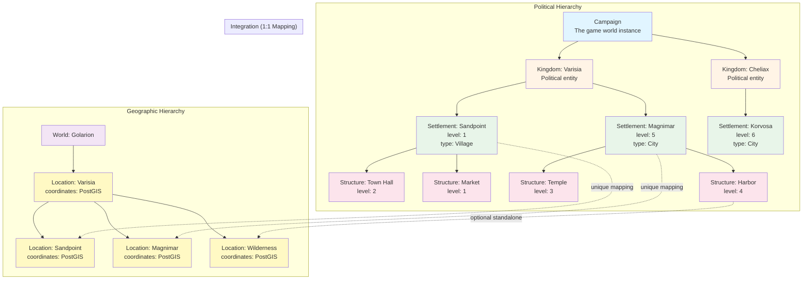

# Settlement & Structure System - Deep Dive

This document provides an in-depth technical exploration of the Settlement and Structure hierarchical system, including the typed variable architecture, level progression mechanics, and integration patterns with other Campaign Manager systems.

## Table of Contents

- [Overview](#overview)
- [System Architecture](#system-architecture)
- [Hierarchical Design](#hierarchical-design)
- [Typed Variable System](#typed-variable-system)
- [Level Progression System](#level-progression-system)
- [Implementation Details](#implementation-details)
- [Integration Patterns](#integration-patterns)
- [Design Decisions](#design-decisions)
- [Performance Considerations](#performance-considerations)
- [Examples & Use Cases](#examples--use-cases)
- [Future Extensions](#future-extensions)

---

## Overview

The Settlement and Structure system provides a flexible, hierarchical framework for managing player-owned and NPC-controlled locations in tabletop RPG campaigns. The system supports:

- **Dynamic hierarchies** (kingdoms → settlements → structures)
- **Typed custom variables** (runtime-configurable with schema validation)
- **Level progression** (settlements and structures can level up)
- **Geographic integration** (settlements map to locations with PostGIS coordinates)
- **Event-driven state changes** (effects can modify settlement/structure variables)
- **Condition-based logic** (JSONLogic expressions reference settlement state)

**Key Design Philosophy**: Flexibility without database migrations. Game designers should be able to create new settlement types with custom variables without changing the schema.

---

## System Architecture

### Entity Hierarchy

The system implements a **3-tier political hierarchy** alongside a separate **geographic hierarchy**:

```
Political Hierarchy:
Campaign → Kingdom → Settlement → Structure

Geographic Hierarchy:
World → Location (with parent-child relationships)

Integration:
Settlement ←1:1→ Location (unique mapping)
Structure →  Settlement (many-to-one)
Structure →  Location (optional, for standalone structures)
```

**Visual Representation**:



**Key Observations**:

- **Two Separate Trees**: Political control (Campaign→Kingdom→Settlement→Structure) vs Geographic containment (World→Location)
- **1:1 Bridge**: Settlement-Location mapping links the two hierarchies
- **Flexible Structures**: Can belong to Settlement OR standalone at Location
- **Level Progression**: Both Settlements and Structures have levels (1-20 scale)

**Key Relationships**:

| Relationship           | Type        | Description                                                 |
| ---------------------- | ----------- | ----------------------------------------------------------- |
| Campaign → Kingdom     | One-to-Many | Campaigns contain multiple kingdoms/factions                |
| Kingdom → Settlement   | One-to-Many | Kingdoms control multiple settlements                       |
| Settlement → Location  | One-to-One  | Each settlement has exactly one geographic location         |
| Settlement → Structure | One-to-Many | Settlements contain multiple structures (buildings)         |
| Location → Structure   | One-to-Many | Locations can have standalone structures (ruins, monuments) |

### Data Model

**Settlement Model**:

```prisma
model Settlement {
  id              String   @id @default(cuid())
  kingdomId       String
  locationId      String   @unique  // One-to-one with Location
  name            String
  description     String?
  level           Int      @default(1)
  settlementType  String   // "Village", "Town", "City", "Fortress"

  // Typed Variable System
  variableSchemas Json     @default("[]")  // Array of variable definitions
  variables       Json     @default("{}")  // Current variable values

  // Versioning & Soft Delete
  version         Int      @default(1)
  deletedAt       DateTime?
  archivedAt      DateTime?

  createdAt       DateTime @default(now())
  updatedAt       DateTime @updatedAt

  // Relations
  kingdom         Kingdom     @relation(fields: [kingdomId], references: [id], onDelete: Cascade)
  location        Location    @relation(fields: [locationId], references: [id], onDelete: Cascade)
  structures      Structure[]
  stateVariables  StateVariable[]

  @@index([kingdomId])
  @@index([locationId])
  @@index([settlementType])
  @@index([level])
  @@index([deletedAt])
  @@index([archivedAt])
}
```

**Structure Model**:

```prisma
model Structure {
  id             String   @id @default(cuid())
  settlementId   String?
  locationId     String?  // Optional: for standalone structures
  name           String
  description    String?
  level          Int      @default(1)
  structureType  String   // "Barracks", "Market", "Temple", "Wall"

  // Typed Variable System (same pattern as Settlement)
  variableSchemas Json     @default("[]")
  variables       Json     @default("{}")

  // Versioning & Soft Delete
  version         Int      @default(1)
  deletedAt       DateTime?
  archivedAt       DateTime?

  createdAt       DateTime @default(now())
  updatedAt       DateTime @updatedAt

  // Relations
  settlement      Settlement?      @relation(fields: [settlementId], references: [id], onDelete: Cascade)
  location        Location?        @relation(fields: [locationId], references: [id], onDelete: Cascade)
  stateVariables  StateVariable[]

  @@index([settlementId])
  @@index([locationId])
  @@index([structureType])
  @@index([level])
  @@index([deletedAt])
  @@index([archivedAt])
}
```

---

## Hierarchical Design

### Current Implementation

The current system implements a **flat settlement list** with **nested structures**:

- **Kingdoms** contain multiple **Settlements**
- **Settlements** contain multiple **Structures**
- **Locations** form an independent geographic hierarchy

**Why flat settlements?**

The schema includes `parentSettlementId` (for future nested settlements like districts), but it's currently unused because:

1. **Simplicity**: Most campaigns don't need sub-settlements
2. **Query complexity**: Recursive queries would be needed for hierarchical operations
3. **Current use case**: Flat list is sufficient for majority of campaigns

**Structure Relationships**:

Structures can belong to either:

1. **A Settlement** (`settlementId` is set): Most common case (e.g., Temple of Desna in Sandpoint)
2. **A Location directly** (`locationId` is set, `settlementId` is null): For ruins, monuments, standalone buildings

**Example Hierarchy** (from seed data):

```
Kingdom: Varisia
├─ Settlement: Sandpoint (Level 2, Village)
│  ├─ Structure: Temple of Desna (Level 1, Temple)
│  ├─ Structure: Sandpoint Market (Level 1, Market)
│  ├─ Structure: Town Guard Barracks (Level 2, Barracks)
│  └─ Structure: Sandpoint Wooden Walls (Level 1, Wall)
├─ Settlement: Magnimar (Level 4, City)
│  ├─ Structure: Arvensoar (Level 3, Fortress)
│  ├─ Structure: Bazaar of Sails (Level 4, Market)
│  └─ Structure: Monument District (Level 2, Monument)
└─ Settlement: Korvosa (Level 5, Metropolis)
   ├─ Structure: Acadamae (Level 4, Academy)
   ├─ Structure: Great Tower (Level 5, Fortress)
   └─ Structure: Castle Korvosa (Level 5, Palace)
```

### Geographic vs Political Hierarchies

**Why separate hierarchies?**

- **Different concerns**: Geographic containment ≠ political control
- **Different query patterns**: Spatial queries (distance, containment) vs ownership queries
- **Data types**: Locations use PostGIS geometry, settlements don't need it
- **Flexibility**: A location can change political control without changing geography

**Example**:

```typescript
// Location hierarchy (geographic)
World: Golarion
└─ Location: Varisia (Region, Polygon)
   ├─ Location: Sandpoint (City, Point)
   └─ Location: Thistletop Island (Island, Polygon)

// Political hierarchy
Kingdom: Varisia
└─ Settlement: Sandpoint → Location: Sandpoint (1:1 mapping)

// Geographic query: "What's within 50km of Sandpoint?"
// Uses PostGIS: ST_DWithin(location.geom, sandpoint.geom, 50000)

// Political query: "What settlements does Varisia control?"
// Uses foreign key: WHERE settlement.kingdomId = varisia.id
```

### Hierarchical Query Patterns

**Get all structures for a settlement**:

```typescript
const settlement = await prisma.settlement.findUnique({
  where: { id: settlementId },
  include: {
    structures: {
      where: { deletedAt: null },
      orderBy: { level: 'desc' },
    },
  },
});
```

**Get all settlements for a kingdom**:

```typescript
const settlements = await prisma.settlement.findMany({
  where: {
    kingdomId,
    deletedAt: null,
  },
  include: {
    location: true, // Include geographic data
    structures: {
      where: { deletedAt: null },
    },
  },
});
```

**Future: Recursive settlement hierarchy** (when `parentSettlementId` is used):

```typescript
async function getSettlementDescendants(settlementId: string): Promise<Settlement[]> {
  const children = await prisma.settlement.findMany({
    where: { parentSettlementId: settlementId, deletedAt: null },
  });

  const descendants = [...children];
  for (const child of children) {
    descendants.push(...(await getSettlementDescendants(child.id)));
  }

  return descendants;
}
```

---

## Typed Variable System

### Overview

The typed variable system provides **runtime-configurable data fields** with **schema validation**, allowing game designers to create custom settlement/structure types without database migrations.

**Two Complementary Fields**:

1. **`variableSchemas`** (JSON array): Metadata defining what variables _can_ exist
2. **`variables`** (JSON object): Actual runtime values

**Visual Flow**:

```mermaid
flowchart TB
    subgraph "1. Schema Definition (Design Time)"
        GM[Game Master] -->|Define custom fields| Schema[variableSchemas<br/>JSON Array]
        Schema --> PopSchema["{ name: 'population',<br/>type: 'number',<br/>min: 0, max: 100000 }"]
        Schema --> MoraleSchema["{ name: 'morale',<br/>type: 'number',<br/>min: 0, max: 100 }"]
        Schema --> TypeSchema["{ name: 'type',<br/>type: 'enum',<br/>values: ['farming', 'trading'] }"]
    end

    subgraph "2. Variable Storage (Runtime)"
        Variables[variables<br/>JSON Object]
        PopValue["population: 1200"]
        MoraleValue["morale: 75"]
        TypeValue["type: 'farming'"]

        Variables --> PopValue
        Variables --> MoraleValue
        Variables --> TypeValue
    end

    subgraph "3. Validation (On Update)"
        Mutation[GraphQL Mutation<br/>updateSettlement] --> Validate{Validate against<br/>variableSchemas}
        Validate -->|Valid| Save[Save to variables field]
        Validate -->|Invalid| Error[Validation Error<br/>400 Bad Request]

        Save --> Cache[Invalidate Redis cache<br/>settlement:{id}]
        Cache --> WebSocket[Emit settlement.updated<br/>WebSocket event]
        WebSocket --> Frontend[Frontend refetch/update]
    end

    subgraph "4. Integration (Conditions & Effects)"
        Condition[JSONLogic Condition] -->|Read| Variables
        Condition --> Example1["{ '>=': [{ var: 'population' }, 1000] }"]

        Effect[JSON Patch Effect] -->|Write| Variables
        Effect --> Example2["{ op: 'replace',<br/>path: '/morale',<br/>value: 85 }"]
    end

    Schema -.->|Schema metadata| Validate
    Variables -.->|Current values| Validate
    Variables -.->|Read for evaluation| Condition
    Effect -.->|Modify values| Variables

    style Schema fill:#e1f5ff
    style Variables fill:#e8f5e9
    style Validate fill:#fff4e6
    style Condition fill:#fce4ec
    style Effect fill:#f3e5f5
```

**Key Benefits**:

- **No Migrations**: Add new variables without altering database schema
- **Type Safety**: Runtime validation ensures data integrity
- **Flexibility**: Different settlement types can have completely different variables
- **Integration**: Conditions and Effects can read/write variables using standard patterns

### Variable Schema Structure

Each schema entry defines one variable:

```typescript
interface VariableSchema {
  name: string; // Variable identifier (e.g., "population")
  type: 'string' | 'number' | 'boolean' | 'enum';
  label?: string; // Display label (e.g., "Population")
  description?: string; // Help text
  required?: boolean; // Is this variable required?
  defaultValue?: any; // Default value for new entities

  // Type-specific constraints
  min?: number; // For number: minimum value
  max?: number; // For number: maximum value
  enumValues?: string[]; // For enum: allowed values
}
```

**Example Settlement Variable Schema** (Village):

```json
[
  {
    "name": "population",
    "type": "number",
    "label": "Population",
    "required": true,
    "min": 0,
    "defaultValue": 100
  },
  {
    "name": "defenseRating",
    "type": "number",
    "label": "Defense Rating",
    "required": true,
    "min": 0,
    "max": 20,
    "defaultValue": 5
  },
  {
    "name": "hasWalls",
    "type": "boolean",
    "label": "Has Walls",
    "defaultValue": false
  },
  {
    "name": "primaryIndustry",
    "type": "string",
    "label": "Primary Industry",
    "description": "Main economic activity"
  },
  {
    "name": "marketSize",
    "type": "enum",
    "label": "Market Size",
    "enumValues": ["none", "small", "medium", "large", "metropolis"],
    "defaultValue": "small"
  }
]
```

**Corresponding Variables** (runtime values):

```json
{
  "population": 1500,
  "defenseRating": 8,
  "hasWalls": false,
  "primaryIndustry": "fishing",
  "marketSize": "small"
}
```

### Supported Variable Types

#### 1. String

Free-form text values.

```json
{
  "name": "motto",
  "type": "string",
  "label": "Settlement Motto",
  "defaultValue": ""
}
```

**Example values**: `"A beacon in the dark"`, `"Desna's chosen"`, `"fishing"`

#### 2. Number

Numeric values with optional min/max constraints.

```json
{
  "name": "garrison",
  "type": "number",
  "label": "Garrison Size",
  "min": 0,
  "defaultValue": 50
}
```

**Example values**: `150`, `500`, `0`

#### 3. Boolean

True/false flags.

```json
{
  "name": "hasWalls",
  "type": "boolean",
  "label": "Has Walls",
  "defaultValue": false
}
```

**Example values**: `true`, `false`

#### 4. Enum

Restricted set of predefined values.

```json
{
  "name": "marketSize",
  "type": "enum",
  "label": "Market Size",
  "enumValues": ["none", "small", "medium", "large", "metropolis"],
  "defaultValue": "small"
}
```

**Example values**: `"small"`, `"large"`, `"metropolis"`

### Validation

**Application-Layer Validation** (not enforced at database level):

```typescript
// packages/api/src/settlements/variable-schema.service.ts
export class VariableSchemaService {
  validateVariables(
    variableSchemas: VariableSchema[],
    variables: Record<string, any>
  ): ValidationResult {
    const errors: string[] = [];

    // Check required variables
    for (const schema of variableSchemas) {
      if (schema.required && !(schema.name in variables)) {
        errors.push(`Required variable '${schema.name}' is missing`);
      }
    }

    // Validate each variable
    for (const [name, value] of Object.entries(variables)) {
      const schema = variableSchemas.find((s) => s.name === name);
      if (!schema) {
        errors.push(`Unknown variable '${name}'`);
        continue;
      }

      // Type validation
      if (schema.type === 'number') {
        if (typeof value !== 'number') {
          errors.push(`Variable '${name}' must be a number`);
        } else {
          if (schema.min !== undefined && value < schema.min) {
            errors.push(`Variable '${name}' must be >= ${schema.min}`);
          }
          if (schema.max !== undefined && value > schema.max) {
            errors.push(`Variable '${name}' must be <= ${schema.max}`);
          }
        }
      } else if (schema.type === 'boolean') {
        if (typeof value !== 'boolean') {
          errors.push(`Variable '${name}' must be a boolean`);
        }
      } else if (schema.type === 'string') {
        if (typeof value !== 'string') {
          errors.push(`Variable '${name}' must be a string`);
        }
      } else if (schema.type === 'enum') {
        if (!schema.enumValues?.includes(value)) {
          errors.push(`Variable '${name}' must be one of: ${schema.enumValues?.join(', ')}`);
        }
      }
    }

    return { valid: errors.length === 0, errors };
  }
}
```

**Usage in Service Layer**:

```typescript
async updateSettlement(id: string, data: UpdateSettlementInput): Promise<Settlement> {
  const settlement = await this.prisma.settlement.findUnique({ where: { id } });

  // Validate variables against schema
  if (data.variables) {
    const validation = this.variableSchemaService.validateVariables(
      settlement.variableSchemas as VariableSchema[],
      data.variables
    );

    if (!validation.valid) {
      throw new BadRequestException(`Invalid variables: ${validation.errors.join(', ')}`);
    }
  }

  return this.prisma.settlement.update({
    where: { id },
    data: {
      ...data,
      version: { increment: 1 }, // Optimistic locking
    },
  });
}
```

### Integration with Conditions & Effects

**JSONLogic Conditions** can reference settlement/structure variables:

```json
{
  "and": [
    { ">=": [{ "var": "settlement.variables.population" }, 1000] },
    { ">=": [{ "var": "settlement.variables.defenseRating" }, 10] },
    { "==": [{ "var": "settlement.variables.hasWalls" }, true] }
  ]
}
```

**Evaluation Context**:

```typescript
const context = {
  settlement: {
    id: settlement.id,
    name: settlement.name,
    level: settlement.level,
    variables: settlement.variables, // All custom variables available
  },
};

const result = jsonLogic.apply(condition.formula, context);
```

**JSON Patch Effects** can modify variables:

```json
[
  { "op": "add", "path": "/settlement/variables/population", "value": 500 },
  { "op": "replace", "path": "/settlement/variables/morale", "value": 80 },
  { "op": "remove", "path": "/settlement/variables/plague" }
]
```

**Effect Application**:

```typescript
async applyEffect(effect: Effect, settlementId: string): Promise<void> {
  const settlement = await this.prisma.settlement.findUnique({
    where: { id: settlementId },
  });

  // Apply JSON Patch operations
  const updatedVariables = applyPatch(
    settlement.variables,
    effect.operations as Operation[]
  ).newDocument;

  // Validate after patch
  const validation = this.variableSchemaService.validateVariables(
    settlement.variableSchemas as VariableSchema[],
    updatedVariables
  );

  if (!validation.valid) {
    throw new Error(`Effect would create invalid state: ${validation.errors.join(', ')}`);
  }

  // Save changes
  await this.prisma.settlement.update({
    where: { id: settlementId },
    data: {
      variables: updatedVariables,
      version: { increment: 1 },
    },
  });

  // Invalidate caches
  await this.cacheService.invalidateSettlement(settlementId);
}
```

---

## Level Progression System

### Overview

The `level` field (1-20 scale) represents the **tier, importance, or advancement** of a settlement or structure. Levels correlate with size, capabilities, and influence.

### Settlement Level Guidelines

While not strictly enforced, the following correlations are typical:

| Level | Settlement Type          | Population Range | Typical Defense | Example                      |
| ----- | ------------------------ | ---------------- | --------------- | ---------------------------- |
| 1     | Hamlet/Village           | < 2,000          | 5-8             | Small fishing village        |
| 2     | Large Village/Small Town | 2,000-5,000      | 8-12            | Sandpoint (seed data)        |
| 3     | Town                     | 5,000-15,000     | 12-15           | Regional trade hub           |
| 4     | City                     | 15,000-40,000    | 15-18           | Magnimar (seed data)         |
| 5+    | Metropolis/Capital       | 40,000+          | 18-20           | Korvosa (seed data, level 5) |

**From Seed Data**:

```typescript
const settlements = [
  { name: 'Sandpoint', level: 2, population: 1500, type: 'Village' },
  { name: 'Magnimar', level: 4, population: 16000, type: 'City' },
  { name: 'Korvosa', level: 5, population: 18500, type: 'Metropolis' },
  { name: 'Riddleport', level: 3, population: 10000, type: 'Town' },
];
```

### Structure Level Guidelines

Structure level is typically **less than or equal to** the parent settlement's level:

| Structure Type     | Typical Max Level | Notes                                    |
| ------------------ | ----------------- | ---------------------------------------- |
| Basic Temple       | 1-3               | Small shrines to minor temples           |
| Market             | 1-4               | From village market to metropolis bazaar |
| Barracks           | 1-3               | Training facilities                      |
| Wall               | 1-2               | Wooden palisade to stone walls           |
| Fortress           | 3-5               | Major defensive structures               |
| Academy/University | 4-5               | Only in large cities                     |

**Example** (Sandpoint, level 2):

```typescript
{
  name: "Sandpoint",
  level: 2,
  structures: [
    { name: "Temple of Desna", level: 1, type: "Temple" },
    { name: "Sandpoint Market", level: 1, type: "Market" },
    { name: "Town Guard Barracks", level: 2, type: "Barracks" }, // Max level = settlement level
    { name: "Sandpoint Wooden Walls", level: 1, type: "Wall" },
  ]
}
```

### Level Change Side Effects

When a settlement or structure level changes, the following operations are triggered:

**1. Version Increment** (optimistic locking):

```typescript
await prisma.settlement.update({
  where: { id, version: expectedVersion },
  data: {
    level: newLevel,
    version: { increment: 1 },
  },
});
```

**2. Audit Trail Logging**:

```typescript
await prisma.audit.create({
  data: {
    campaignId,
    userId,
    entityType: 'Settlement',
    entityId: id,
    action: 'update',
    previousState: { level: oldLevel },
    newState: { level: newLevel },
    diff: [{ op: 'replace', path: '/level', value: newLevel }],
    metadata: { reason: 'Level progression' },
  },
});
```

**3. Cache Invalidation**:

```typescript
await cacheService.invalidateSettlement(settlementId);
await cacheService.invalidateKingdomSettlements(kingdomId);
```

**4. WebSocket Broadcast** (real-time updates):

```typescript
await webSocketGateway.broadcastToSession(sessionId, {
  type: 'SETTLEMENT_UPDATED',
  payload: { settlementId, level: newLevel },
});
```

**5. Rules Engine Re-evaluation** (future):

- Conditions referencing `settlement.level` are re-evaluated
- Events dependent on level thresholds may be triggered
- Effects may cascade to child structures

### Front-End Level Controls

From TICKET-036 implementation:

```tsx
function SettlementLevelControl({ settlement }: Props) {
  const [level, setLevel] = useState(settlement.level);
  const [version, setVersion] = useState(settlement.version);

  const handleLevelChange = async (delta: number) => {
    const newLevel = Math.max(1, Math.min(20, level + delta));

    // Optimistic update
    setLevel(newLevel);

    try {
      const result = await setSettlementLevel({
        variables: {
          id: settlement.id,
          level: newLevel,
          expectedVersion: version,
        },
      });

      setVersion(result.version);
      toast.success(`Settlement level changed to ${newLevel}`);
    } catch (error) {
      // Revert on error
      setLevel(level);
      if (error.message.includes('version')) {
        toast.error('Settlement was modified by another user. Please refresh.');
      } else {
        toast.error('Failed to update level');
      }
    }
  };

  return (
    <div>
      <Button onClick={() => handleLevelChange(-1)}>−</Button>
      <span>Level {level}</span>
      <Button onClick={() => handleLevelChange(1)}>+</Button>
    </div>
  );
}
```

---

## Implementation Details

### Service Layer

**SettlementService** (`packages/api/src/settlements/settlements.service.ts`):

```typescript
@Injectable()
export class SettlementsService {
  constructor(
    private prisma: PrismaService,
    private variableSchemaService: VariableSchemaService,
    private cacheService: CacheService,
    private auditService: AuditService
  ) {}

  async findOne(id: string): Promise<Settlement> {
    return this.prisma.settlement.findUnique({
      where: { id, deletedAt: null },
      include: {
        kingdom: true,
        location: true,
        structures: {
          where: { deletedAt: null },
        },
      },
    });
  }

  async create(data: CreateSettlementInput, userId: string): Promise<Settlement> {
    // Validate variables
    const validation = this.variableSchemaService.validateVariables(
      data.variableSchemas || [],
      data.variables || {}
    );
    if (!validation.valid) {
      throw new BadRequestException(`Invalid variables: ${validation.errors.join(', ')}`);
    }

    // Check location uniqueness
    const existing = await this.prisma.settlement.findUnique({
      where: { locationId: data.locationId },
    });
    if (existing) {
      throw new ConflictException('Location already has a settlement');
    }

    const settlement = await this.prisma.settlement.create({
      data: {
        ...data,
        version: 1,
      },
      include: {
        kingdom: true,
        location: true,
      },
    });

    // Audit trail
    await this.auditService.log({
      campaignId: settlement.kingdom.campaignId,
      userId,
      entityType: 'Settlement',
      entityId: settlement.id,
      action: 'create',
      newState: settlement,
    });

    // Invalidate cache
    await this.cacheService.invalidateKingdomSettlements(settlement.kingdomId);

    return settlement;
  }

  async setLevel(
    id: string,
    level: number,
    expectedVersion: number,
    userId: string
  ): Promise<Settlement> {
    const settlement = await this.findOne(id);

    if (settlement.version !== expectedVersion) {
      throw new ConflictException('Settlement was modified by another user');
    }

    if (level < 1 || level > 20) {
      throw new BadRequestException('Level must be between 1 and 20');
    }

    const updated = await this.prisma.settlement.update({
      where: { id, version: expectedVersion },
      data: {
        level,
        version: { increment: 1 },
      },
      include: {
        kingdom: true,
        location: true,
        structures: { where: { deletedAt: null } },
      },
    });

    // Audit trail
    await this.auditService.log({
      campaignId: settlement.kingdom.campaignId,
      userId,
      entityType: 'Settlement',
      entityId: id,
      action: 'update',
      previousState: { level: settlement.level },
      newState: { level },
      diff: [{ op: 'replace', path: '/level', value: level }],
    });

    // Cache invalidation
    await this.cacheService.invalidateSettlement(id);
    await this.cacheService.invalidateKingdomSettlements(settlement.kingdomId);

    return updated;
  }

  async archive(id: string, userId: string): Promise<Settlement> {
    const settlement = await this.findOne(id);

    const archived = await this.prisma.settlement.update({
      where: { id },
      data: {
        archivedAt: new Date(),
        version: { increment: 1 },
      },
    });

    await this.auditService.log({
      campaignId: settlement.kingdom.campaignId,
      userId,
      entityType: 'Settlement',
      entityId: id,
      action: 'archive',
    });

    await this.cacheService.invalidateSettlement(id);
    await this.cacheService.invalidateKingdomSettlements(settlement.kingdomId);

    return archived;
  }
}
```

**StructureService** follows the same pattern with minor differences (supports both `settlementId` and standalone `locationId`).

### GraphQL Schema

**Types** (`packages/api/src/settlements/settlements.types.ts`):

```graphql
type Settlement {
  id: ID!
  kingdomId: ID!
  locationId: ID!
  name: String!
  description: String
  level: Int!
  settlementType: String!
  variableSchemas: [VariableSchema!]!
  variables: JSON!
  version: Int!
  deletedAt: DateTime
  archivedAt: DateTime
  createdAt: DateTime!
  updatedAt: DateTime!

  # Relations
  kingdom: Kingdom!
  location: Location!
  structures: [Structure!]!
  computedFields: [ComputedField!]! # Derived from StateVariable
}

type VariableSchema {
  name: String!
  type: VariableType!
  label: String
  description: String
  required: Boolean
  defaultValue: JSON
  min: Float
  max: Float
  enumValues: [String!]
}

enum VariableType {
  STRING
  NUMBER
  BOOLEAN
  ENUM
}

type Structure {
  id: ID!
  settlementId: ID
  locationId: ID
  name: String!
  description: String
  level: Int!
  structureType: String!
  variableSchemas: [VariableSchema!]!
  variables: JSON!
  version: Int!
  deletedAt: DateTime
  archivedAt: DateTime
  createdAt: DateTime!
  updatedAt: DateTime!

  # Relations
  settlement: Settlement
  location: Location
  computedFields: [ComputedField!]!
}
```

**Queries & Mutations**:

```graphql
type Query {
  settlement(id: ID!): Settlement
  settlements(campaignId: ID!): [Settlement!]!
  settlementsByKingdom(kingdomId: ID!): [Settlement!]!

  structure(id: ID!): Structure
  structures(settlementId: ID!): [Structure!]!
}

type Mutation {
  createSettlement(input: CreateSettlementInput!): Settlement!
  updateSettlement(id: ID!, input: UpdateSettlementInput!): Settlement!
  setSettlementLevel(id: ID!, level: Int!, expectedVersion: Int!): Settlement!
  archiveSettlement(id: ID!): Settlement!
  deleteSettlement(id: ID!): Boolean!

  createStructure(input: CreateStructureInput!): Structure!
  updateStructure(id: ID!, input: UpdateStructureInput!): Structure!
  setStructureLevel(id: ID!, level: Int!, expectedVersion: Int!): Structure!
  archiveStructure(id: ID!): Structure!
  deleteStructure(id: ID!): Boolean!
}
```

**Resolvers** (`packages/api/src/settlements/settlements.resolver.ts`):

```typescript
@Resolver(() => Settlement)
export class SettlementsResolver {
  constructor(
    private settlementsService: SettlementsService,
    private stateVariableService: StateVariableService
  ) {}

  @Query(() => Settlement)
  async settlement(@Args('id') id: string): Promise<Settlement> {
    return this.settlementsService.findOne(id);
  }

  @Query(() => [Settlement])
  async settlementsByKingdom(@Args('kingdomId') kingdomId: string): Promise<Settlement[]> {
    return this.settlementsService.findByKingdom(kingdomId);
  }

  @Mutation(() => Settlement)
  @UseGuards(GqlAuthGuard)
  async setSettlementLevel(
    @Args('id') id: string,
    @Args('level', { type: () => Int }) level: number,
    @Args('expectedVersion', { type: () => Int }) expectedVersion: number,
    @CurrentUser() user: User
  ): Promise<Settlement> {
    return this.settlementsService.setLevel(id, level, expectedVersion, user.id);
  }

  // Field resolver for computed fields
  @ResolveField(() => [ComputedField])
  async computedFields(@Parent() settlement: Settlement): Promise<ComputedField[]> {
    return this.stateVariableService.getComputedFieldsForScope('settlement', settlement.id);
  }
}
```

### Cache Strategy

**Cache Keys**:

```typescript
const CACHE_KEYS = {
  settlement: (id: string) => `settlement:${id}`,
  kingdomSettlements: (kingdomId: string) => `kingdom:${kingdomId}:settlements`,
  settlementStructures: (settlementId: string) => `settlement:${settlementId}:structures`,
};
```

**Cache Policy** (Apollo Client):

```typescript
const cache = new InMemoryCache({
  typePolicies: {
    Query: {
      fields: {
        settlement: {
          read(_, { args, toReference }) {
            return toReference({ __typename: 'Settlement', id: args.id });
          },
        },
        settlementsByKingdom: {
          keyArgs: ['kingdomId'],
        },
      },
    },
    Settlement: {
      keyFields: ['id'],
      fields: {
        structures: {
          merge(existing = [], incoming) {
            return incoming;
          },
        },
      },
    },
  },
});
```

**Cache Invalidation**:

```typescript
// After mutation
await client.refetchQueries({
  include: [
    { query: GET_SETTLEMENT, variables: { id: settlementId } },
    { query: GET_KINGDOM_SETTLEMENTS, variables: { kingdomId } },
  ],
});

// Or use cache.evict()
cache.evict({ id: `Settlement:${settlementId}` });
cache.gc();
```

---

## Integration Patterns

### 1. Conditions (JSONLogic)

Conditions can reference settlement/structure state for dynamic evaluation:

```typescript
// Event condition: "Festival requires population >= 1000 and morale >= 60"
const condition = {
  formula: {
    and: [
      { '>=': [{ var: 'settlement.variables.population' }, 1000] },
      { '>=': [{ var: 'settlement.variables.morale' }, 60] },
    ],
  },
};

// Evaluation context
const settlement = await prisma.settlement.findUnique({ where: { id } });
const context = {
  settlement: {
    id: settlement.id,
    name: settlement.name,
    level: settlement.level,
    variables: settlement.variables,
  },
};

const canTrigger = jsonLogic.apply(condition.formula, context);
```

### 2. Effects (JSON Patch)

Effects can modify settlement/structure variables as side effects of events:

```typescript
// Effect: "Festival increases morale by 10"
const effect = {
  operations: [{ op: 'add', path: '/settlement/variables/morale', value: 10 }],
};

// Application
const settlement = await prisma.settlement.findUnique({ where: { id } });
const patched = applyPatch(settlement.variables, effect.operations);

await prisma.settlement.update({
  where: { id },
  data: {
    variables: patched.newDocument,
    version: { increment: 1 },
  },
});
```

### 3. State Variables (Computed Fields)

StateVariable can create computed fields derived from settlement variables using JSONLogic formulas:

```typescript
// Computed field: "isLargeCity" = population > 15000
const stateVariable = await prisma.stateVariable.create({
  data: {
    campaignId,
    scope: 'settlement',
    scopeId: settlementId,
    name: 'isLargeCity',
    value: null, // Computed dynamically
    formula: {
      '>': [{ var: 'settlement.variables.population' }, 15000],
    },
  },
});

// Evaluation (on-demand)
const context = { settlement: { variables: settlement.variables } };
const value = jsonLogic.apply(stateVariable.formula, context);
```

### 4. Dependency Graph

Settlements can be tracked in the dependency graph for cache invalidation:

```typescript
// When settlement.variables.morale changes, find dependent conditions
const dependentConditions = await prisma.fieldCondition.findMany({
  where: {
    stateVariable: {
      scope: 'settlement',
      scopeId: settlementId,
      name: 'morale',
    },
  },
  include: {
    condition: {
      include: { event: true, encounter: true },
    },
  },
});

// Re-evaluate all dependent conditions
for (const fc of dependentConditions) {
  await rulesEngineService.evaluateCondition(fc.condition.id);
}
```

### 5. Rules Engine Worker

The rules-engine worker evaluates conditions in bulk:

```typescript
// RPC request to rules-engine
const response = await rulesEngineClient.evaluateConditions({
  conditions: [
    {
      id: 'condition1',
      formula: { '>=': [{ var: 'settlement.variables.population' }, 1000] },
      context: { settlement: { variables: { population: 1500 } } },
    },
  ],
});

// Response: [{ id: 'condition1', result: true }]
```

### 6. Real-Time Updates (WebSocket)

Settlement changes broadcast to connected clients:

```typescript
// Server-side (after settlement update)
await webSocketGateway.broadcastToSession(sessionId, {
  type: 'SETTLEMENT_UPDATED',
  payload: {
    settlementId,
    changes: {
      level: newLevel,
      variables: updatedVariables,
    },
  },
});

// Client-side (React hook)
useWebSocket(sessionId, (message) => {
  if (message.type === 'SETTLEMENT_UPDATED') {
    // Update Apollo cache
    cache.updateFragment({
      id: `Settlement:${message.payload.settlementId}`,
      fragment: gql`
        fragment UpdatedSettlement on Settlement {
          level
          variables
        }
      `,
      data: message.payload.changes,
    });
  }
});
```

---

## Design Decisions

### Why JSON for Variables Instead of Fixed Columns?

**Advantages**:

1. **Flexibility**: New settlement types (fortress, trading post, temple) can have different variables without migrations
2. **Extensibility**: Game designers can add custom variables via UI
3. **No NULL Pollution**: One JSON column vs 20+ nullable columns
4. **Schema Evolution**: Variable schemas can evolve without ALTER TABLE

**Trade-offs**:

- ❌ **No database-level constraints**: Validation must happen in application layer
- ❌ **Query performance**: Can't index individual variables efficiently
- ❌ **No foreign keys**: Variables can't reference other entities directly

**Mitigation**:

- Application-layer validation via `VariableSchemaService`
- StateVariable model for queryable computed fields
- Caching for read-heavy operations

### Why One-to-One Settlement-Location Mapping?

**Rationale**:

1. **Spatial grounding**: Every settlement needs geographic coordinates for map display
2. **Prevents ambiguity**: One location can't host multiple settlements (enforced by unique constraint)
3. **Simplifies queries**: No need to handle multiple settlements per location

**Alternative Considered**: Many-to-one (multiple settlements per location)

- **Rejected because**: Would require disambiguation logic (which settlement is "primary"?)
- **Current workaround**: Use nested settlements (future) or separate locations for districts

### Why Separate Location and Settlement Hierarchies?

**Geographic Hierarchy** (Location):

- Concerned with **spatial relationships** (containment, distance)
- Uses **PostGIS geometry** for spatial queries
- Hierarchical: Region → Sub-region → City → District

**Political Hierarchy** (Settlement):

- Concerned with **ownership and control**
- Uses **foreign keys** to Kingdom
- Currently flat (no nested settlements)

**Benefits**:

1. **Separation of concerns**: Geography ≠ politics
2. **Different query patterns**: Spatial queries vs ownership queries
3. **Data independence**: Location can exist without settlement (ruins, wilderness)

### Why No Nested Settlements Yet?

The schema includes `parentSettlementId` but it's currently unused.

**Reasons**:

1. **Simplicity**: Flat list is easier to query and render
2. **Current use case**: Most campaigns don't need sub-settlements
3. **Complexity**: Recursive queries, hierarchical permissions, cascade effects

**Future Extension Plan**:

- When nested settlements are needed, activate `parentSettlementId`
- Add GraphQL resolvers for `childSettlements`
- Implement recursive query helpers
- Update UI to show tree view

### Why Optimistic Locking (Version Field)?

**Problem**: Concurrent updates could overwrite each other

**Solution**: Version field prevents lost updates

```typescript
// User A: Reads settlement (version 5)
const settlement = await prisma.settlement.findUnique({ where: { id } });
// settlement.version = 5

// User B: Updates settlement (version 5 → 6)
await prisma.settlement.update({
  where: { id, version: 5 },
  data: { level: 3, version: { increment: 1 } },
});

// User A: Tries to update (fails because version is now 6)
await prisma.settlement.update({
  where: { id, version: 5 }, // ❌ No rows match
  data: { variables: { morale: 80 }, version: { increment: 1 } },
});
// Throws error: "Settlement was modified by another user"
```

---

## Performance Considerations

### Database Indexes

**Strategic indexes** for common queries:

```prisma
model Settlement {
  @@index([kingdomId])        // For: settlementsByKingdom()
  @@index([locationId])       // For: JOIN with Location
  @@index([settlementType])   // For: filtering by type
  @@index([level])            // For: filtering by level
  @@index([deletedAt])        // For: soft delete queries
  @@index([archivedAt])       // For: archive filtering
}

model Structure {
  @@index([settlementId])     // For: structures by settlement
  @@index([locationId])       // For: standalone structures
  @@index([structureType])    // For: filtering by type
  @@index([level])            // For: filtering by level
}
```

### Batch Loading (N+1 Prevention)

Use DataLoader or include relations in initial query:

```typescript
// ❌ N+1 query problem
const settlements = await prisma.settlement.findMany();
for (const settlement of settlements) {
  const structures = await prisma.structure.findMany({
    where: { settlementId: settlement.id },
  });
}

// ✅ Batch load with include
const settlements = await prisma.settlement.findMany({
  include: {
    structures: { where: { deletedAt: null } },
    location: true,
  },
});
```

### Front-End Optimizations

**Virtual Scrolling** (for 50+ structures):

```tsx
import { FixedSizeList } from 'react-window';

function StructureList({ structures }: Props) {
  return (
    <FixedSizeList height={600} itemCount={structures.length} itemSize={80} width="100%">
      {({ index, style }) => (
        <div style={style}>
          <StructureCard structure={structures[index]} />
        </div>
      )}
    </FixedSizeList>
  );
}
```

**Debounced Search**:

```tsx
const [searchTerm, setSearchTerm] = useState('');
const debouncedSearch = useDebouncedValue(searchTerm, 300);

const filteredSettlements = useMemo(() => {
  return settlements.filter((s) => s.name.toLowerCase().includes(debouncedSearch.toLowerCase()));
}, [settlements, debouncedSearch]);
```

### Cache Warming

Pre-populate cache for common queries:

```typescript
// On application startup
async function warmSettlementCache() {
  const campaigns = await prisma.campaign.findMany({ take: 10 });

  for (const campaign of campaigns) {
    const kingdoms = await prisma.kingdom.findMany({
      where: { campaignId: campaign.id },
    });

    for (const kingdom of kingdoms) {
      const settlements = await prisma.settlement.findMany({
        where: { kingdomId: kingdom.id },
        include: { structures: true },
      });

      await cacheService.set(`kingdom:${kingdom.id}:settlements`, settlements, { ttl: 3600 });
    }
  }
}
```

---

## Examples & Use Cases

### Example 1: Creating a Settlement with Custom Variables

```typescript
const settlement = await settlementsService.create(
  {
    kingdomId: 'kingdom_varisia',
    locationId: 'location_sandpoint',
    name: 'Sandpoint',
    description: 'A small coastal town on the Varisian Gulf',
    level: 2,
    settlementType: 'Village',
    variableSchemas: [
      { name: 'population', type: 'number', required: true, min: 0, defaultValue: 1500 },
      { name: 'defenseRating', type: 'number', required: true, min: 0, max: 20, defaultValue: 8 },
      { name: 'hasWalls', type: 'boolean', defaultValue: false },
      { name: 'primaryIndustry', type: 'string', defaultValue: 'fishing' },
      {
        name: 'marketSize',
        type: 'enum',
        enumValues: ['small', 'medium', 'large'],
        defaultValue: 'small',
      },
    ],
    variables: {
      population: 1500,
      defenseRating: 8,
      hasWalls: false,
      primaryIndustry: 'fishing',
      marketSize: 'small',
    },
  },
  userId
);
```

### Example 2: Leveling Up a Settlement

```typescript
// Settlement grows from level 2 → 3
const settlement = await settlementsService.findOne(settlementId);
const newLevel = settlement.level + 1;

const updated = await settlementsService.setLevel(
  settlementId,
  newLevel,
  settlement.version,
  userId
);

// Side effects triggered:
// 1. Version incremented (2 → 3)
// 2. Audit log created
// 3. Cache invalidated
// 4. WebSocket broadcast sent
// 5. Conditions re-evaluated (future)
```

### Example 3: Event Effect Modifying Settlement

```typescript
// Event: "Swallowtail Festival" completes
// Effect: Increase morale by 10
const event = await prisma.event.findUnique({
  where: { id: eventId },
  include: { effects: true },
});

for (const effect of event.effects) {
  if (effect.timing === EffectTiming.ON_RESOLVE) {
    await effectService.applyEffect(effect, {
      settlementId: 'settlement_sandpoint',
    });
  }
}

// Result: settlement.variables.morale: 60 → 70
```

### Example 4: Condition Checking Settlement State

```typescript
// Event: "Goblin Raid" has condition:
// "Can only trigger if settlement has no walls"
const condition = {
  formula: {
    '==': [{ var: 'settlement.variables.hasWalls' }, false],
  },
};

const settlement = await prisma.settlement.findUnique({
  where: { id: 'settlement_sandpoint' },
});

const context = {
  settlement: {
    variables: settlement.variables, // { hasWalls: false }
  },
};

const canTrigger = jsonLogic.apply(condition.formula, context);
// Result: true (no walls, so raid can happen)
```

### Example 5: Hierarchical Structure Query

```typescript
// Get all structures for a settlement, grouped by type
const settlement = await prisma.settlement.findUnique({
  where: { id: settlementId },
  include: {
    structures: {
      where: { deletedAt: null },
      orderBy: [{ structureType: 'asc' }, { level: 'desc' }],
    },
  },
});

// Group by type
const groupedStructures = settlement.structures.reduce(
  (acc, structure) => {
    const type = structure.structureType;
    if (!acc[type]) acc[type] = [];
    acc[type].push(structure);
    return acc;
  },
  {} as Record<string, Structure[]>
);

// Result:
// {
//   "Temple": [{ name: "Temple of Desna", level: 1 }],
//   "Market": [{ name: "Sandpoint Market", level: 1 }],
//   "Barracks": [{ name: "Town Guard Barracks", level: 2 }],
//   "Wall": [{ name: "Sandpoint Wooden Walls", level: 1 }]
// }
```

---

## Future Extensions

### 1. Nested Settlement Hierarchy

**Goal**: Support districts/sub-settlements (e.g., Magnimar → Old Dock District → Rag's End neighborhood)

**Implementation**:

1. Activate `parentSettlementId` field
2. Add GraphQL resolvers:
   ```graphql
   type Settlement {
     parent: Settlement
     children: [Settlement!]!
   }
   ```
3. Implement recursive query helpers
4. Update UI to show tree view with expand/collapse

**Migration**:

```prisma
model Settlement {
  parentSettlementId String?

  parent   Settlement?  @relation("SettlementHierarchy", fields: [parentSettlementId], references: [id])
  children Settlement[] @relation("SettlementHierarchy")

  @@index([parentSettlementId])
}
```

### 2. Structure Prerequisites Based on Level

**Goal**: Restrict structures to settlement level (e.g., Academy requires settlement level >= 4)

**Implementation**:

```typescript
interface StructureTypeDefinition {
  type: string;
  minSettlementLevel: number;
  maxLevel: number;
}

const STRUCTURE_TYPES: StructureTypeDefinition[] = [
  { type: 'Temple', minSettlementLevel: 1, maxLevel: 5 },
  { type: 'Market', minSettlementLevel: 1, maxLevel: 4 },
  { type: 'Barracks', minSettlementLevel: 1, maxLevel: 3 },
  { type: 'Academy', minSettlementLevel: 4, maxLevel: 5 },
  { type: 'University', minSettlementLevel: 5, maxLevel: 5 },
];

// Validation in service
async createStructure(data: CreateStructureInput): Promise<Structure> {
  const settlement = await this.prisma.settlement.findUnique({
    where: { id: data.settlementId },
  });

  const structureDef = STRUCTURE_TYPES.find(s => s.type === data.structureType);
  if (settlement.level < structureDef.minSettlementLevel) {
    throw new BadRequestException(
      `${data.structureType} requires settlement level >= ${structureDef.minSettlementLevel}`
    );
  }

  // ...
}
```

### 3. Variable Schema Templates

**Goal**: Pre-defined variable schemas for common settlement types

**Implementation**:

```typescript
const SETTLEMENT_TEMPLATES = {
  village: [
    { name: 'population', type: 'number', required: true, min: 0, defaultValue: 500 },
    { name: 'morale', type: 'number', min: 0, max: 100, defaultValue: 60 },
    { name: 'hasWalls', type: 'boolean', defaultValue: false },
  ],
  city: [
    { name: 'population', type: 'number', required: true, min: 5000 },
    { name: 'morale', type: 'number', min: 0, max: 100, defaultValue: 70 },
    { name: 'hasWalls', type: 'boolean', defaultValue: true },
    { name: 'criminalActivity', type: 'number', min: 0, max: 100, defaultValue: 20 },
    { name: 'marketSize', type: 'enum', enumValues: ['medium', 'large', 'metropolis'] },
  ],
  fortress: [
    { name: 'garrison', type: 'number', required: true, min: 100 },
    { name: 'defenseRating', type: 'number', required: true, min: 15, max: 20 },
    { name: 'hasWalls', type: 'boolean', defaultValue: true },
    { name: 'siegePreparedness', type: 'number', min: 0, max: 100 },
  ],
};

// Usage
const settlement = await settlementsService.createFromTemplate({
  template: 'village',
  name: 'Sandpoint',
  variables: { population: 1500 }, // Override defaults
});
```

### 4. Computed Variable Formulas

**Goal**: Auto-calculate variables based on other variables (e.g., `taxRevenue = population * 0.1`)

**Implementation**: Use StateVariable with JSONLogic formulas

```typescript
// Create computed field
await stateVariableService.create({
  campaignId,
  scope: 'settlement',
  scopeId: settlementId,
  name: 'taxRevenue',
  formula: {
    '*': [{ var: 'settlement.variables.population' }, 0.1],
  },
});

// Evaluate on-demand
const taxRevenue = await stateVariableService.evaluateComputed(settlementId, 'taxRevenue');
```

### 5. Variable Change History

**Goal**: Track historical variable values for analytics/rollback

**Implementation**:

```prisma
model VariableHistory {
  id          String   @id @default(cuid())
  entityType  String   // "Settlement" | "Structure"
  entityId    String
  variableName String
  oldValue    Json
  newValue    Json
  changedAt   DateTime @default(now())
  changedBy   String?  // User ID

  @@index([entityType, entityId, variableName])
  @@index([changedAt])
}
```

---

## See Also

- **System Overview**: [docs/architecture/system-overview.md](system-overview.md) - High-level architecture
- **Data Model**: [docs/architecture/data-model.md](data-model.md) - Complete Prisma schema documentation
- **Condition System**: [docs/features/condition-system.md](../features/condition-system.md) - JSONLogic integration
- **Effect System**: [docs/features/effect-system.md](../features/effect-system.md) - JSON Patch state mutations
- **GraphQL API**: (Future: API documentation) - Query/mutation reference

---

**Last Updated**: 2024-11-09
**Status**: Settlement system implemented, Structure system implemented, Nested settlements planned for future
