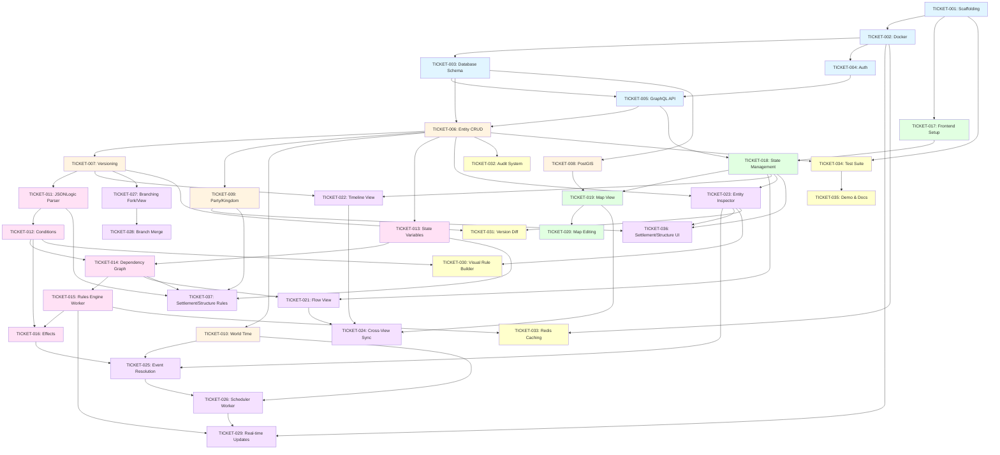

# Campaign Management Tool - Epic

## Overview

Build a full-stack campaign management tool for tabletop RPGs that unifies map, flowchart, and timeline views around shared domain objects (locations, encounters, events, characters). The system supports temporal versioning (history), branching (what-if scenarios), and conditional availability via a rules engine.

## Tech Stack

- **Backend**: NestJS (GraphQL API), Node workers (rules engine, scheduler)
- **Frontend**: React + TypeScript + Vite
- **Database**: PostgreSQL + PostGIS, Redis
- **Storage**: S3-compatible (MinIO)
- **Deployment**: Docker Compose

## Architecture

Gateway API → Rules Engine + Scheduler → PostgreSQL/PostGIS + Redis + MinIO ← React Frontend

## Epic Status

- **Total Tickets**: 37
- **Completed**: 30
- **In Progress**: 0
- **Not Started**: 7

## Tickets by Status

### Infrastructure & Setup (Milestone 1: Weeks 1-2)

- [x] [TICKET-001](TICKET-001.md) - Project Scaffolding & Repository Setup
- [x] [TICKET-002](TICKET-002.md) - Docker Compose Infrastructure
- [x] [TICKET-003](TICKET-003.md) - Database Schema Design & Prisma Setup
- [x] [TICKET-004](TICKET-004.md) - Authentication & Authorization System
- [x] [TICKET-005](TICKET-005.md) - Basic GraphQL API with NestJS ✓

### Core Data Layer (Milestone 2: Weeks 3-4)

- [x] [TICKET-006](TICKET-006.md) - Entity CRUD Operations ✓
- [x] [TICKET-007](TICKET-007.md) - Versioning System Implementation ✓
- [x] [TICKET-008](TICKET-008.md) - PostGIS Spatial Data Integration ✓
- [x] [TICKET-009](TICKET-009.md) - Party & Kingdom Management ✓
- [x] [TICKET-010](TICKET-010.md) - World Time System ✓

### Rules Engine (Milestone 3: Weeks 5-6)

- [x] [TICKET-011](TICKET-011.md) - JSONLogic Expression Parser ✓
- [x] [TICKET-012](TICKET-012.md) - Condition System Implementation ✓
- [x] [TICKET-013](TICKET-013.md) - State Variable System ✓
- [x] [TICKET-014](TICKET-014.md) - Dependency Graph Builder ✓
- [x] [TICKET-015](TICKET-015.md) - Rules Engine Service Worker ✓
- [x] [TICKET-016](TICKET-016.md) - Effect System Implementation

### Frontend Core (Milestone 2-3: Weeks 3-6)

- [x] [TICKET-017](TICKET-017.md) - Frontend Project Setup (React + Vite) ✓
- [x] [TICKET-018](TICKET-018.md) - State Management & GraphQL Client ✓
- [x] [TICKET-019](TICKET-019.md) - Map View with MapLibre ✓
- [x] [TICKET-020](TICKET-020.md) - Map Editing Tools (Draw/Edit Geometry) ✓

### Advanced Features (Milestone 4: Weeks 7-8)

- [x] [TICKET-021](TICKET-021.md) - Flow View with React Flow ✓
- [x] [TICKET-022](TICKET-022.md) - Timeline View Implementation ✓
- [x] [TICKET-023](TICKET-023.md) - Entity Inspector Component ✓
- [x] [TICKET-024](TICKET-024.md) - Cross-View Synchronization ✓
- [x] [TICKET-025](TICKET-025.md) - Event & Encounter Resolution System ✓
- [x] [TICKET-026](TICKET-026.md) - Scheduler Service Worker ✓
- [x] [TICKET-036](TICKET-036.md) - Settlement & Structure Hierarchical UI ✓
- [x] [TICKET-037](TICKET-037.md) - Settlement & Structure Rules Integration ✓

### Branching & Advanced Systems (Milestone 5: Weeks 9-10)

- [x] [TICKET-027](TICKET-027.md) - Branching System (Fork & View) ✓
- [x] [TICKET-028](TICKET-028.md) - Branch Merge & Conflict Resolution ✓
- [ ] [TICKET-029](TICKET-029.md) - Real-time Updates via WebSocket/Redis

### UX & Polish (Milestone 6: Weeks 11-12)

- [ ] [TICKET-030](TICKET-030.md) - Visual Rule Builder UI
- [ ] [TICKET-031](TICKET-031.md) - Version History & Diff Viewer
- [ ] [TICKET-032](TICKET-032.md) - Audit System
- [ ] [TICKET-033](TICKET-033.md) - Caching Layer with Redis
- [ ] [TICKET-034](TICKET-034.md) - Comprehensive Test Suite
- [ ] [TICKET-035](TICKET-035.md) - Demo Seed Data & Documentation

## Dependency Graph

## Parallel Work Streams

### Stream 1: Infrastructure (Weeks 1-2)

Can be done in parallel after T001:

- T002 (Docker)
- T017 (Frontend Setup)

### Stream 2: Core Backend (Weeks 2-4)

After T003, T004, T005 complete:

- T006 → T007 (sequential)
- T008 (parallel with T006/T007)
- T009, T010 (parallel after T006)

### Stream 3: Rules Engine (Weeks 5-6)

After T007, T006 complete:

- T011 → T012 (sequential)
- T013 (parallel with T011/T012)
- Then T014 → T015 → T016 (sequential)
- T037 (after T011, T013, T014, T009 complete)

### Stream 4: Frontend Views (Weeks 3-8)

After T017, T018 complete:

- T019 → T020 (sequential)
- T021 (parallel with T019/T020)
- T022 (parallel with T019/T020/T021)
- T023 (parallel with T019/T020/T021/T022)
- T036 (after T023, T009, T018 complete)

### Stream 5: Advanced Features (Weeks 7-9)

- T024 (after T019, T021, T022)
- T025 → T026 (sequential, after T010, T016)
- T027 → T028 (sequential, after T007)

### Stream 6: Real-time & Polish (Weeks 9-12)

- T029 (after T015, T026)
- T030, T031, T032, T033 (can be parallel)
- T034 → T035 (sequential, at the end)

## Critical Path

T001 → T002 → T003 → T005 → T006 → T007 → T011 → T012 → T014 → T015 → T025 → T026 → T029 → T034 → T035

## Notes

- Tickets are numbered based on logical implementation order
- Some tickets can be worked on in parallel (see dependency graph)
- Each ticket includes acceptance criteria, technical notes, and completion tracking
- TICKET-036 and TICKET-037 are Settlement/Structure-specific enhancements
- Total estimated time: 12-13 weeks with appropriate parallelization
